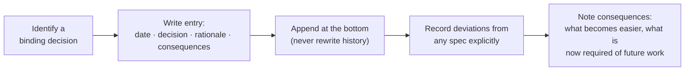
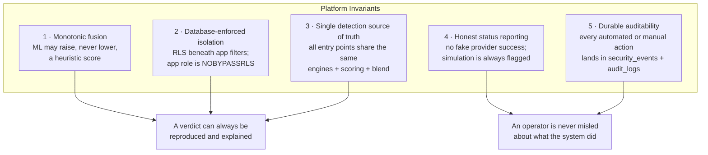

# DECISIONS

Append-only decision log. Each entry: date, decision, rationale, and
consequences. Newest entries at the bottom.

## Table of Contents

**Architecture & Tenancy:** Monotonic hybrid blending · Dedicated `cyberguard`
schema + RLS (Phase -1) · Owner-scoped tenancy & org freeze · Phase -1 spec
deviations · Backend-mediated signup/sign-in · ORG-1 org foundation (API keys,
RBAC) · ORG-2 log analytics & realtime publication · ORG-3 org mail connectors ·
ORG-4 role-grouped notifications · ORG-5 provenance docs & realtime tightening

**Integrations & Response:** Gmail connector & token vault (Phase 1-2) ·
Stateless mailbox scanning (Phase 3) · Real Gmail enforcement + expiry
scheduler (Phase 4) · Dual-write security history (Phase 5) · 14-method
provider contract + DB-logged notifications (Phase 6-7) · Workspace-scoped nav

**Quality & Evaluation:** Pytest evaluation harness

**Real-Time Pipeline (RT-1..RT-10):** Arq over Celery · Durable job ledger ·
Thin webhook · history.list sync · Poison-pill fetch worker · Engine reuse in
analysis worker · Realtime-first frontend · Watch renewal crons · Observability ·
DLQ ops

## Decision Timeline

```mermaid
flowchart LR
    subgraph P0["Phase -1 · Foundations"]
        A1["Schema + RLS<br/>cyberguard_api NOBYPASSRLS"]
        A2["Owner-scoped tenancy<br/>ORG_ENABLED=false"]
        A3["Backend-mediated auth<br/>server-enforced usernames"]
    end

    subgraph P12["Phases 1-3 · Connect & Scan"]
        B1["Own OAuth client<br/>+ Fernet token vault"]
        B2["Stateless deterministic<br/>mailbox scanning"]
    end

    subgraph P47["Phases 4-7 · Respond & Notify"]
        C1["Real Gmail enforcement<br/>+ 5-min expiry scheduler"]
        C2["Dual-write history<br/>+ actor distinction"]
        C3["14-method provider contract<br/>+ DB-logged notifications"]
    end

    subgraph ORG["Orgs Phase · ORG-1..5"]
        D1["Header API keys<br/>cg_live_* · SHA-256"]
        D2["Shape-based log analytics<br/>+ alert promotion"]
        D3["Org mail connectors<br/>(SimulationTransport)"]
        D4["Role-grouped<br/>notifications"]
        D5["Provenance docs +<br/>realtime policy tightening"]
    end

    subgraph RT["RT Phase · RT-1..10"]
        E1["Arq + Redis<br/>worker separation"]
        E2["Durable job_queue<br/>+ deterministic IDs"]
        E3["Thin webhook<br/><50 ms"]
        E4["Retry matrix<br/>+ DLQ"]
    end

    A1 --> A2 --> A3 --> B1 --> B2 --> C1 --> C2 --> C3 --> D1 --> D2 --> D3 --> D4 --> D5 --> E1 --> E2 --> E3 --> E4
```

## Technology Selection Matrix

The decisions below record *why* each major technology won its slot:

| Decision Domain | Selected | Rejected Alternatives | Rationale (source ADR) |
|---|---|---|---|
| Distributed task queue | **Arq + Redis** | Celery (+ kombu/AMQP) | asyncio-native; fits FastAPI + SQLAlchemy 2.0 async with zero threadpools and only two dependencies (RT-1) |
| Job durability | **PostgreSQL `job_queue` ledger** | Redis-only queues | In-memory queues are ephemeral; durable table enables audit, re-enqueue, DLQ (RT-2) |
| Tenancy isolation | **PostgreSQL RLS + GUCs** | App-layer filters only | A query-filter bug cannot leak cross-tenant data; `cyberguard_api` is NOBYPASSRLS (Phase -1) |
| Mailbox token custody | **Own Google OAuth client + Fernet vault** | Supabase Google IdP tokens | Login tokens must never be confused with mailbox tokens (Phase 1-2) |
| Key hashing (org API keys) | **SHA-256 exact-match** | bcrypt / argon2 | Keys are 256-bit random secrets; indexed exact-match validation needs no password-style stretching (ORG-1) |
| Log-type detection | **Payload SHAPE auto-detection** | Client-declared type | Clients lie / misconfigure; shape is intrinsic (ORG-2) |
| Realtime policy recursion | **SECURITY DEFINER `org_member_role()`** | Direct EXISTS on `organization_members` | Self-referential policy recursion; definer function avoids infinite loop (ORG-1) |
| Enforcement gating | **Corroboration gate** | Single-engine auto-block | Auto-enforcement only on critical severity AND ≥2 engines high+ (DATABASE_DESIGN / action_engine) |
| Expiry scheduling | **Hand-rolled asyncio loop (5 min)** | apscheduler | Fails safe, no extra dependency, service-role engine (Phase 4) |
| LLM explanation fallback | **Deterministic rule-based generator** | Fail the request | 100% platform availability regardless of LLM key health (ai/llm_client) |
| Notification delivery | **DB-logged backend by default** | SMTP-only | Deterministic demo with zero external dependency; SMTP optional with fallback (Phase 6-7) |
| Frontend realtime | **Supabase Realtime + 60 s polling fallback** | Raw WebSockets / SSE | Sub-3 s push latency with silent graceful degradation (RT-7) |

## How to Read an ADR (and Add One)

Every entry below follows that shape. Documented deviations from a phase spec
are deliberate extensions, not omissions — each one lists the reason it exists.

---

- **Decision.** Hybrid blending is monotonic: ML can raise but never lower a heuristic score (safety property).

- **2026-09-13 — Dedicated `cyberguard` schema + PostgreSQL RLS as the isolation backbone (Phase -1).**
  All application tables moved out of `public` into a dedicated `cyberguard`
  schema, managed by Alembic migrations (introduced this phase; previously
  schema existed only as `Base.metadata.create_all`). The backend connects as
  a dedicated `cyberguard_api` role with `NOBYPASSRLS`; row visibility is
  governed by the `app.user_id` / `request.role` GUCs (session-scoped
  `set_config`, applied per transaction by an `after_begin` event and reset on
  session release). Rationale: database-enforced isolation beneath the
  application filters, so a bug in a query filter cannot leak another user's
  data. Consequences: migrations are now the schema source of truth
  (`create_all` remains as checkfirst bootstrap for SQLite tests, which run
  schema-free via `schema_translate_map`); unauthenticated requests can read
  nothing from owner tables by construction.

- **2026-09-13 — Owner-scoped tenancy in the active path; organization features frozen, not removed (Phase -1).**
  Personal workspaces are the active product surface: every request resolves
  to `TenantContext{organization_id: None, owner_user_id: user.id, role:
  "admin"}` and all queries filter through `tenant_criteria(model, tenant)`.
  Organization tables, code paths, and the server-mode integration surface
  (`routes_integrations`, `enforcement_engine`, `action_executor`) are frozen
  behind `ORG_ENABLED=false` (501 "coming soon") and reactivate with the later
  Orgs Phase. Rationale: decouple, don't demolish — the user-only path must
  not depend on org membership. Consequences: rows created in personal mode
  carry `organization_id = NULL` plus `owner_user_id`; org-mode data written
  by integrations without `owner_user_id` stays invisible under RLS until the
  Orgs Phase revisits policies.

- **2026-09-13 — Deliberate extensions to the Phase -1 spec (documented deviations).**
  1. **GUC application is lazy (per transaction), not at session acquire.**
     `get_current_user` depends on `get_db`, so the session exists *before*
     the user is known; an acquire-time `set_config` would always see NULL.
     The `after_begin` event applies the GUC at the first execution of every
     transaction, which also covers the JIT user upsert that must itself pass
     the `users` RLS policy. `request.role='authenticated'` is set alongside
     so the app role can read the shared-read tables per spec.
  2. **Shared-read tables also carry an app-role policy** (`response_catalog`,
     `organizations`) — otherwise startup seeding of the response catalog and
     `/auth/me` break under RLS for `cyberguard_api`.
  3. **`response_executions` received `owner_user_id`** beyond the spec's
     column list — it is a first-class personal-workspace table and would
     otherwise be deny-all under RLS.
  4. **Child/join tables** (`recommended_actions`, `incident_alerts`,
     `incident_events`, `organization_members`) got EXISTS-on-parent /
     `user_id` policies — RLS-enabled tables without policies are deny-all.
  5. **`enforcement_policies.organization_id` made nullable** — personal
     workspaces own policies directly with `organization_id = NULL`.
  6. **Migration `0003_rls` creates missing roles** (`cyberguard_api`,
     `authenticated`) so the chain installs on vanilla PostgreSQL, not only
     Supabase; the cutover then only sets LOGIN/PASSWORD.
  7. **Frozen-org 501 uses a dedicated `ComingSoonError` handler** to emit the
     spec'd `{"detail": "Organization accounts are coming soon."}` envelope
     while leaving the global error shapes untouched.

- **2026-09-13 — Backend-mediated signup/sign-in with server-enforced usernames (Phase -1).**
  `POST /auth/signup` and `POST /auth/signin` now proxy Supabase Auth from the
  backend so `username` (`^[a-z0-9_.]{3,32}$`, DB-unique) can be enforced and
  resolved server-side (username → email lookup runs on the service-role
  engine, `app/db/admin.py`, because RLS denies anonymous reads of `users`).
  The frontend installs the returned session via `supabase.auth.setSession`,
  keeping the existing token-refresh flow intact. OAuth users get their
  project row (with an auto-generated unique username) via the JIT upsert in
  `get_current_user`. Rationale: username uniqueness across auth identities
  cannot be guaranteed client-side.

- **2026-09-13 — Gmail connector with own OAuth client, encrypted token vault, honest provider registry (Phase 1-2).**
  Gmail mailbox access uses a dedicated Google Cloud OAuth client owned by
  CYBERGUARD — deliberately separate from Supabase's Google identity provider,
  so login tokens can never be confused with mailbox tokens. Tokens are
  encrypted at rest (Fernet via `CONNECTOR_TOKEN_KEY`) and never leave the
  backend; the OAuth callback authenticates with a single-use expiring state
  row (consumed via the service-role helper) instead of a bearer token, and
  redirects carry only a safe status. The provider registry declares Gmail
  enabled (when configured) and Outlook/Yahoo/iCloud as coming-soon or
  unsupported with explicit reasons — no fake provider success anywhere.
  Rationale: mailbox access is the highest-sensitivity integration the
  platform has, so token custody, audit (`connector_operation_logs`), and
  honest capability reporting are foundational. Mailbox scanning is Phase 3;
  quarantine/sender actions Phase 4; event email notifications Phase 7.

- **2026-09-13 — Mailbox scanning is stateless, deterministic, and analysis-only (Phase 3).**
  Provider messages normalize into `NormalizedMessage` (Gmail MIME/base64url
  parsing lives in the adapter; engines never see provider formats). Scans run
  the existing heuristic + ML engines (phishing, URL, impersonation; media
  attachments are honestly skipped — no binary is downloaded yet) and aggregate
  with the shared `scoring_service` weights. Scan results are computed on
  request rather than persisted, so the reported verdict can always be
  reproduced from the message itself. Enforcement is reported as
  `provider_operation_status = "deferred_to_phase_4"` — the UI shows the
  recommendation and explicitly states nothing was done to the mailbox.
  Overall explanations are generated by deterministic rules (fast, stable, and
  auditable) instead of the LLM, which remains available for interactive use.

- **2026-09-13 — Enforcement executes real Gmail writes with a 5-minute asyncio expiry scheduler (Phase 4).**
  Quarantine is implemented with Gmail labels (`CYBERGUARD-Quarantine` added,
  `INBOX` removed) and release reverses it; sender blocking uses Gmail filters
  (`gmail.settings.basic` scope added to the OAuth consent — without
  re-consent the adapter surfaces `insufficient_scope` honestly). Per-user
  settings (expiry 3h/24h/custom/manual, permanent-delete toggle,
  auto-quarantine toggle) gate every action; nothing is simulated. The expiry
  scheduler is a hand-rolled asyncio loop (no apscheduler dependency) running
  on the service-role engine, and it fails safe: a provider error leaves the
  item quarantined/blocked with `last_error` recorded for retry next pass.
  Extensions to the spec's schema: `owner_user_id` denormalized on
  connector_settings/quarantined_items/blocked_senders (required for the RLS
  owner-policy pattern) and `last_error` columns for honest failure reporting.
  The Phase 3 deferral semantics remain only where enforcement is disabled or
  unnecessary — a successful action now reports `provider_operation_status =
  "success"` with the concrete Gmail operations performed.

- **2026-09-13 — Dual-write security history + audit with actor distinction; chat excluded from permanent history (Phase 5).**
  `record_event` writes one `security_events` row AND a matching `audit_logs`
  row with the same `actor_type` (user | system | scheduler), guaranteeing the
  two ledgers never disagree about who acted. Writers must pass the real
  provider operation outcome — history defaults are success-free by design.
  The review view (`/quarantine/{id}/review`) assembles the ordered event
  chain per message and computes available actions from live state (item
  status, connector readiness, permanent-delete setting) rather than offering
  static buttons. AI chat remains ephemeral: sessionStorage-only under a
  per-tab key, destroyed on tab close, and the assistant's audit entry now
  records the intent class only — chat content is never permanent history.
  Migration `0006` backfills `audit_logs.actor_type='user'`; the history
  backfill script is idempotent against pre-Phase-5 enforcement rows.

- **2026-09-13 — 14-method provider contract with capability gating, and DB-logged email notifications for demo reliability (Phase 6-7).**
  The `EmailProvider` contract was finalized to the Excalidraw 14 methods
  with a `capabilities` property exposing `supports_*` boolean flags; the
  enforcement engine and scheduler resolve providers through
  `get_provider(connector.provider)` and consult capabilities before acting
  (a provider without sender-rule support skips filter creation and says so).
  An in-memory `MockEmailProvider` with configurable failure flags proves the
  engine is Gmail-independent. Notifications deliberately use a DB-logged
  delivery backend as the default: the rendered email is persisted to
  `notification_logs` (status sent/failed, `backend=db_log`), making the demo
  deterministic with zero external dependency; optional SMTP is best-effort
  with automatic fallback. The recipient is always the user-registered
  `users.notification_email` — connected mailboxes are never used for system
  notifications (privacy/spam boundary). `backend` was added to the spec's
  notification_logs columns to record the actual delivery path.

- **2026-09-13 — Workspace-scoped navigation from a single nav source; Log Analysis as the client log-paste feature (frontend).**
  Per the Excalidraw step-1 client/organization split: personal workspaces get
  the six analysis features (Dashboard, Phishing, URL, Impersonation,
  Deepfake, and the new Log Analysis paste-box) plus the email-security
  pages; org-side modules (Account Takeover, Network & API, Alerts,
  Incidents, Response Actions, Audit Logs, Reports, approvals/policies/org
  management) are hidden in personal mode AND route-guarded — the guard
  renders a ComingSoon placeholder instead of redirecting, and the backend's
  501/401 responses remain the second line of defense. `frontend/src/nav.ts`
  is the only nav list; Sidebar and route guards both consume it, so moving a
  feature between scopes is a one-line change. Log Analysis is the
  client-facing "log paste and analyze" feature: it auto-detects auth-log vs
  network-flow JSON, drives the existing detectors analysis-only, and shows
  honest format errors — no sample auto-fills, no fake data.

- **2026-09-13 — Real pytest evaluation harness with online-fetch + mandatory synthetic fallback (evaluation layer).**
  The regression suite (scripts/run_all_tests.py) and the new pytest harness
  (backend/tests/) are deliberately separate: the regression suite guards
  behavior, the harness measures quality at scale (P/R/F1/AUC, band
  separation, Mann-Whitney p, latency percentiles) and never fixes app code —
  findings are recorded in the report instead. Online datasets (SMS Spam
  Collection, OpenPhish) are fetched once, cached (gitignored), and
  provenance-tracked; seeded deterministic synthetic generators are a
  mandatory fallback so the suite runs fully offline at the venue. Metrics
  use an adaptive positive threshold (midpoint of class means) for engines
  whose score ranges sit below 50, and threshold-free AUC as the headline
  metric. The harness surfaced two real calibration findings on first run
  (v2 URL model FPs on benign top-1m domains; per-flow network heuristics
  blind to low-and-slow beaconing) — recorded, not fixed.

- **2026-09-14 — ORG-1 foundation: header-based API keys, org-scoped gateway, salted org names, admin/analyst/viewer RBAC (Orgs Phase).**
  The org-side surface activates as a new always-on `/orgs` router (the
  frozen `/organizations` router stays byte-for-byte unchanged while
  `ORG_ENABLED=false`). Binding decisions: server-to-server auth via
  `org_authorization: <key>` header with SHA-256-hashed, prefix-displayed
  keys (plaintext returned exactly once; SHA-256 over bcrypt/argon2 because
  keys are 256-bit random secrets and validation is an indexed exact-match
  lookup — no new dependency); org names salted on conflict ("Acme Corp" →
  "Acme Corp-2") at the application layer rather than by a DB unique
  constraint (personal workspaces legitimately share the name "Personal
  Workspace"); gateway is organization-scoped
  (`POST /api/v1/org/{org_id}/gateway`, actions `scan_email` / `scan_url` /
  `ingest_log`) so a valid key against another org's endpoint is a 403.
  RLS: all org predicates run through a `SECURITY DEFINER`
  `org_member_role()` function — direct `EXISTS` on `organization_members`
  from its own policy recurses infinitely — with an owner fallback (the
  creator is definitionally an admin) that also survives `autoflush=False`
  flush ordering. `organization_api_keys` SELECT is intentionally permissive
  for the app role because hash validation runs before any identity exists;
  writes are admin-gated at both the RLS and API layers. `organizations`
  itself keeps the baseline app-role policy (tightening it would break
  personal-workspace bootstrap); membership checks at the API layer plus
  real RLS on the org child tables provide the isolation Suite 17 asserts.
  Consequences: the full regression suite (which had been red since the RLS
  baseline cutover — direct-session fixtures never stamped `app.user_id`)
  was brought back to green with test-harness-only GUC fixes plus two real
  RLS bug fixes (integration pipeline and action executor now propagate
  `owner_user_id`; startup policy seeding runs via the service role); org
  events/alerts from the gateway run under the org owner's identity, and
  member-readable org data views are deferred to ORG-2.

- **2026-09-15 — ORG-2: shape-based log auto-detection, alert-plane promotion, manual-decision log actions, realtime via publication filters (Orgs Phase).**
  The Splunk plane classifies ingested logs by payload SHAPE (auth =
  `user`+`ip`(+`status`/`location`); network = `src_ip`/`dst_ip`/`port`/
  `bytes`/`flows`; app = everything else) rather than trusting a
  client-declared type, and runs the matching deterministic detector with NO
  LLM on the ingest path (provider latency/rate limits must never delay log
  ingestion; explanations for promoted alerts use the heuristic fallback).
  Log findings at medium+ are promoted to the alert plane (Event + Alert
  with module account_takeover/network/api_abuse) so dashboards and realtime
  see them. Manual analyst actions on log rows (block_ip, revoke_session,
  isolate_host, escalate_incident, mark_safe) record the DECISION
  (`manual_action_taken` + audit_logs entry, analyst+ RBAC) rather than
  firing enforcement — real targets arrive with ORG-3 connectors.
  Realtime: `org_log_events` (row filter `organization_id IS NOT NULL`) and
  `alerts` (unfiltered — a publication row filter requires the filtered
  column in the table's REPLICA IDENTITY, and alerts.organization_id is
  nullable, so the filter would break every UPDATE; frontend subscribes with
  `organization_id=eq.{org_id}` instead) are added to `supabase_realtime`.
  Demo tradeoff: SELECT policies `TO authenticated` on the two published
  tables let the Realtime subscriber role stream rows; tightening is tracked
  for ORG-5. Org dashboard aggregations run through the service role with an
  explicit organization_id predicate (org rows are owner-scoped in RLS, so
  member sessions would see zero rows); membership is enforced at the API
  layer first. Account Takeover ships as the Coming Soon placeholder per the
  Excalidraw spec; auth-shaped logs are still auto-analyzed on the log plane.

- **2026-09-15 — ORG-3: org mail connectors as infrastructure management, not personal OAuth; pluggable transports without new dependencies; per-server log grouping; graceful disconnect (Orgs Phase).**
  Org mail servers are managed like server assets — a unique-named row per
  server with provider-specific encrypted credentials, its own settings, and
  its own log stream — explicitly distinct from the Phase-2 personal Gmail
  OAuth connector (whose code paths are untouched). Credentials are JSON
  blobs validated against per-provider required fields and Fernet-encrypted
  at rest under the shared CONNECTOR_TOKEN_KEY; plaintext never appears in
  the DB, logs, or API responses (a boolean has_credentials is exposed
  instead). Wire protocol lives behind a pluggable transport registry: the
  shipped SimulationTransport performs real credential validation and
  returns clearly-flagged simulated results (mirroring action_executor's
  honest-simulation pattern), because the prompt's named drivers
  (google-api-python-client, msal) are third-party packages outside the
  frozen dependency set — stdlib imaplib needs no package but the transport
  seam is identical for all three; installing real drivers later is a
  transport registration with zero product-code changes. Logs are grouped
  BY mail server (org_mail_server_logs keyed on mail_server_id, every query
  and UI surface filters per server) because correlating two independent
  infrastructure streams would misattribute connector errors to the wrong
  server. Disconnect is graceful by design: CYBERGUARD stops reading, the
  mail server itself keeps running, and credentials are RETAINED so an admin
  can reconnect without re-entering secrets — deletion is the only path that
  removes stored credentials and the server's log stream. RLS: settings are
  admin/analyst-readable and viewer-blocked at both the API and RLS layers;
  logs reach the owning org through the parent server row's
  org_member_role() predicate.

- **2026-09-15 — ORG-4: role-grouped notification lists with min-role event routing, org-level and separate from Phase 7 (Orgs Phase).**
  Notification recipients are ORG assets, not per-user settings: an
  organization registers MULTIPLE addresses, each assigned to a role group
  (admin/analyst/viewer), and each event type declares the MINIMUM role
  group that receives it (admin → admins only; analyst → analysts+admins;
  viewer → everyone). Defaults: server_down/mail_server_down/critical_log →
  analyst, impersonation → admin (brand-sensitive, admins only by default).
  Wired triggers: mail-server connect failure → mail_server_down, fetch
  failure on a connected server → server_down, medium+ log ingest →
  critical_log, gateway lookalike-domain/display-name-spoof indicators →
  impersonation. Delivery reuses the Phase 7 backend (_deliver: DB-logged by
  default, best-effort SMTP) with per-recipient error isolation, and every
  send persists an org_notification_logs row with per-recipient outcomes;
  a disabled event type produces no sends and no log row (silent no-op).
  RLS: all three tables are admin/analyst-readable and viewer-blocked at
  both the API and RLS layers; writes are admin-only. The Phase 7 per-user
  notification_email paths are untouched — org notifications are a parallel
  system with its own tables, routing, and templates.

- **2026-09-15 — ORG-5: in-app docs with provenance-tracked content + realtime policy tightening completes the org phase (Orgs Phase).**
  The /docs page renders a typed content module (src/docs/content.ts) whose
  examples are mechanically constrained to real artifacts: executed curls
  (recorded in src/docs/PROVENANCE.md), suite-verified outputs, eval-report
  metrics/findings, fixture files, and route transcriptions. The check
  script (frontend/scripts/check-docs.mjs) enforces four invariants — every
  feature guide carries an example, all anchors resolve, audience/minRole
  tags are valid, and every api-reference row matches a REAL route parsed
  from backend routers — and caught two genuine transcription errors on its
  first run (quarantine routes live under /enforcement/*), which is the
  argument for mechanical provenance over prose. Gating: org-audience
  sections badge as "Organization feature" in personal workspaces; minRole
  sections render a reduced set for viewers (RoleGuard-style). Realtime
  tightening (deferred from ORG-2): migration 0012 replaces the permissive
  authenticated SELECT policies on org_log_events + alerts with
  membership-gated predicates through the SECURITY DEFINER
  org_member_role() keyed on auth.uid() (WALRUS), with a personal-owner
  branch for alerts; clean no-op on SQLite/vanilla PG where auth.uid()
  does not exist. Realtime subscribers now stream only rows the calling
  user is entitled to — the demo tradeoff recorded at ORG-2 is closed.

- **2026-09-16 — RT-1: Real-time pipeline infrastructure with Redis + Arq; worker separation (RT Phase).**
  Arq selected over Celery as the distributed task queue: Arq is asyncio-native
  from the ground up, fitting FastAPI's async runtime, SQLAlchemy 2.0 async
  sessions, and asyncpg/aiosqlite without requiring threadpools, kombu, or
  AMQP broker overhead; it introduces only `arq` and `redis` with zero bloat.
  Workers are explicitly split into `gmail-worker` and `email-worker`:
  Gmail ingestion is I/O-bound and bounded by Google OAuth rate limits, whereas
  email threat analysis, ML scoring (XGBoost/TF-IDF), and SOAR enforcement are
  compute/memory-heavy. Isolating them ensures external Gmail quota pressure or
  webhook bursts cannot starve analysis pipelines, and allows independent horizontal
  scaling of analysis workers during high-volume threat bursts.

- **2026-09-16 — RT-2: Real-time pipeline database models, job durability, and scan path separation (RT Phase).**
  1. **Separation of `processed_emails` from `scan_results`:**
     Manual scans (Phase 3) are stateless, user-initiated, on-demand operations that evaluate individual messages or drafts without inbox state tracking. In contrast, real-time push monitoring requires stateful ingestion tracking (history checkpoints, processing stages `received` -> `fetching` -> `fetched` -> `analyzing` -> `analyzed` -> `completed`, signal JSONB caches, and strict message-level idempotency via `UNIQUE(owner_user_id, gmail_message_id)`). Separating `processed_emails` ensures high-throughput ingestion never pollutes or destabilizes the manual audit records while preserving an optional foreign key (`scan_result_id`) when full threat scan artifacts are generated.
  2. **Durable `job_queue` table alongside ephemeral Redis/Arq:**
     Redis and Arq provide ultra-low latency, in-memory job coordination for worker dispatch, but in-memory queues are ephemeral: jobs can be evicted under memory pressure, dropped during Redis restarts, or obscured without auditable operational history. The PostgreSQL `job_queue` table acts as the authoritative source of truth for all worker jobs, recording deterministic job IDs, execution states, payloads, output results, retry counts, and exponential backoff retry schedules (`5s`, `30s`, `2m`, `10m`, `30m`). If Redis restarts or a worker crashes abruptly, the durable table allows unacknowledged or dead-letter jobs to be audited, re-enqueued, and inspected through RLS-isolated admin dashboards.

- **2026-09-16 — RT-3: Thin Gmail Pub/Sub push webhook with deterministic deduplication and rate limiting (RT Phase).**
  1. **Why a thin webhook (<50ms response):**
     Google Cloud Pub/Sub push subscriptions expect HTTP 200/201/204 acknowledgments within tight delivery deadlines (default 10s timeout, with automatic exponential retry on failure). Performing synchronous message retrieval from Gmail or running heavy ML pipelines inside the webhook handler would introduce catastrophic request queueing, timeouts, duplicate redeliveries, and server starvation under high-volume mailbox bursts. The webhook strictly performs token validation, base64 payload decoding, and non-blocking queue dispatch before immediately acknowledging HTTP 200.
  2. **Why deterministic `job_id` (`gmail_sync:{owner_user_id}:{history_id}`):**
     Pub/Sub push architecture is strictly at-least-once: network hiccups, gateway timeouts, or worker acknowledgment delays routinely deliver duplicate push events for the same mailbox event. Using a deterministic job ID guarantees distributed idempotency at both layers: Arq/Redis deduplicates against in-flight jobs, and PostgreSQL's `job_queue` table enforces a unique constraint that immediately returns the existing job without creating duplicate worker executions.
  3. **Why token-bucket rate limiting (Gmail API quota protection):**
     Google Cloud enforces strict per-user rate limits on Gmail API calls (250 requests/second/user). Sudden webhook bursts could trigger HTTP 429 quota exhaustion and cause transient sync failures. An in-memory token bucket per `(owner_user_id, "gmail_sync")` detects exhaustion and automatically enqueues jobs with a 5-second deferral (`defer_by=5s`), smoothing burst traffic while protecting API quota.

- **2026-09-16 — RT-4: Gmail sync worker with history.list discovery and row-locked state updates (RT Phase).**
  1. **Why `users.history.list` over direct message listing (`users.messages.list`):**
     Querying `users.messages.list` with date/label filters requires scanning the user's mailbox and repeatedly evaluating full message lists, which wastes quota, scales poorly with inbox size, and easily misses or misorders messages during rapid delivery spikes. In contrast, Google Cloud Pub/Sub push notifications deliver exact `historyId` checkpoints. Gmail's `users.history.list(startHistoryId=...)` yields an exact, delta-only audit trail of mailbox changes (`messagesAdded`) since the checkpoint. This minimizes Gmail API quota consumption, drastically lowers latency, and guarantees exact-delta ingestion.
  2. **Why `SELECT ... FOR UPDATE` row locks on `gmail_accounts`:**
     Gmail push notifications arrive frequently during active email sessions, often resulting in concurrent webhook delivery and multiple worker processes attempting to sync the same mailbox simultaneously. Without database row locks, concurrent sync tasks would encounter race conditions where an older sync execution could overwrite `last_history_id` with an earlier checkpoint (lost update) or fetch overlapping messages redundantly. A `SELECT ... FOR UPDATE` lock serializes sync execution for a given mailbox while allowing independent mailboxes to process in parallel. Combined with monotonic history ID comparisons (`new > old`), this ensures mailbox state always progresses forward without regression.

- **2026-09-16 — RT-5: Email fetch worker with MIME parsing, content normalization, and poison pill protection (RT Phase).**
  1. **Reusing Phase-2/3 `NormalizedMessage` Parser over duplicate MIME parsing logic:**
     Email MIME structures are notoriously complex (nested multipart/mixed, multipart/alternative, rfc822 headers, encoded-word subjects, non-standard charsets). Duplicating MIME parsing in the worker would create dual maintenance liabilities, inconsistent behavior between manual mailbox scanning (Phase 3) and real-time push ingestion, and subtle security bugs. The worker strictly reuses `gmail_provider._normalize(message_id, raw_message)`, generating a uniform `NormalizedMessage` schema across the entire platform while stripping script/style blocks and sanitizing HTML content into safe plain text.
  2. **Poison pill isolation via `NonRetryableError` and immediate `dead_letter`:**
     Malicious actors or malformed payloads can easily produce pathological inputs (e.g. 50MB attachments, corrupted MIME trees). If handled naively with standard exponential backoff retries, poison pill payloads consume worker threadpools, block Redis queues, and exhaust rate limits, starving healthy accounts. By enforcing strict limits (`MAX_EMAIL_BYTES=10_000_000`, `MAX_BODY_CHARS=200_000`, `MAX_URLS=100`, `MAX_MIME_PARTS=100`, `FETCH_TIMEOUT_S=30`) and raising `NonRetryableError("size_exceeded")`, unrecoverable jobs are routed directly to `dead_letter` status with `retry_count = max_retries` and `processed_emails.processing_status = 'failed'`. This immediately frees the worker queue and enables subsequent healthy jobs to execute without delay.
  3. **Metadata-only attachments and zero content downloads:**
     Real-time email analysis must not download attachment payloads over the wire during ingestion. The fetch worker reads attachment metadata only (`filename`, `mime_type`, `size`, `attachment_id`) into `signals`, avoiding heavy network transfers, storage bloat, and inadvertent execution risks.

- **2026-09-16 — RT-6: Email analysis worker reusing detection engines and linking shared scan results (RT Phase).**
  1. **Reusing existing detection engines (single source of truth):**
     Threat detection logic (phishing heuristic indicators, domain lookalike matching, URL entropy and reputation parsing, executive impersonation heuristics, and SPF/DKIM/DMARC auth validation) must remain 100% consistent across all entry points in the system (interactive analysis endpoints, batch manual mailbox scanning, server-side gateway integrations, and real-time background worker pipelines). Creating worker-specific threat detectors would lead to divergent verdicts, duplicate maintenance burdens, and subtle false-positive/false-negative drift. The analysis worker strictly imports and evaluates `analyze_email_heuristics`, `analyze_url_heuristics`, `analyze_impersonation_heuristics`, and the trained XGBoost ML predictors (`predict_email`, `predict_url`) with monotonic score blending (`max(heuristic, 0.45*heuristic + 0.55*ml)`), ensuring unified analytical integrity across the entire platform.
  2. **Linking `processed_emails` to the shared `scan_results` table:**
     While `processed_emails` acts as the stateful ingestion ledger (handling idempotency, history checkpoints, and multi-stage lifecycle states `received` -> `fetching` -> `fetched` -> `analyzing` -> `analyzed` -> `completed`), analysts and downstream SOAR enforcement workflows (quarantine, user review, security history, SIEM reporting) expect a standard, uniform `scan_results` schema regardless of whether an email was scanned on-demand via Phase-3 mailbox scanning or ingested autonomously in real time via Pub/Sub push notifications. Storing the final verdict, risk score, detailed indicator breakdown, and synthesized explanation in `scan_results` and linking `processed_emails.scan_result_id` allows existing dashboard, review, and enforcement features to operate seamlessly without dual query paths.

- **2026-09-16 — RT-7: Realtime-first frontend subscriptions with 60s polling fallback and zero disruptive error toasts (RT Phase).**
  1. **Realtime-first push architecture via user-scoped Supabase channels:**
     To achieve a sub-3-second end-to-end latency experience from the moment Gmail receives an email to the moment it appears in the Quarantine Queue, the frontend connects directly to Supabase Realtime via the `user:{userId}` broadcast channel. When threat analysis finishes, `email_analyzed` broadcast events immediately prepend new quarantined messages to the top of the queue with an attention-guiding highlight animation, auto-scroll critical arrivals into view if the user is near the top of the screen, and increment the live count badge in the sidebar without requiring disruptive full-page refreshes.
  2. **Graceful degradation to 60s polling fallback without user-facing errors:**
     Websockets and external realtime channels are inherently susceptible to transient network disconnections, corporate firewall restrictions, token expirations, and offline local development environments without configured Supabase credentials. Rather than surfacing jarring error toasts or blocking the interface, `useRealtimeEmails` initiates a 5-second graceful connection timeout. If subscription does not succeed within 5 seconds or encounters channel error states, the hook automatically flips to an unobtrusive 60-second polling fallback reusing the existing quarantine list endpoint. The UI status pill transparently indicates amber `POLLING` with an informative tooltip, keeping user data consistently fresh while maintaining a silent, error-free user experience. Upon socket reconnection, realtime subscriptions resume and polling timers are cleanly disposed.

- **2026-09-16 — RT-8: Watch renewal and reconciliation scheduled workers as safety nets for Pub/Sub (RT Phase).**
  1. **Why 4x daily watch renewal (7-day expiry buffer):**
     Google Cloud Gmail `users.watch` subscriptions automatically expire after 7 days (604,800 seconds). If a subscription lapses without renewal, Google silently stops publishing push notifications to the Cloud Pub/Sub topic, halting all real-time ingestion until manually reconnected. A naive once-per-week or daily cron poses high operational risk if a single renewal fails due to transient network or Google 5xx errors. Scheduling `renew_watches` 4 times daily (`00:00`, `06:00`, `12:00`, `18:00`) with a 24-hour expiration lookahead (`watch_expiration < now() + 24h`) ensures any watch nearing expiration has multiple renewal opportunities and buffers against temporary Google Cloud or network outages.
  2. **Why periodic reconciliation (Pub/Sub drops messages if queues are down):**
     While Google Cloud Pub/Sub push delivery is resilient, it guarantees delivery only within topic retention windows and will discard or dead-letter unacknowledged messages during extended downstream worker downtime, Redis backlog spikes, or firewall resets. Relying solely on push notifications leaves mailboxes vulnerable to silent desynchronization. The `reconcile_stuck_accounts` cron job runs twice hourly (`:15`, `:45`), checking for active accounts that have not synced in over 2 hours and transiently errored accounts (excluding fatal `reauth_required` or `scope_error`). By dispatching deterministic `gmail_sync:{owner_user_id}:reconciliation` jobs, the system automatically catches up missed message deltas via Gmail's `history.list` API, providing an autonomous self-healing safety net without full-mailbox polling overhead.

- **2026-09-16 — RT-9: Observability with structured JSON logs, correlation ID propagation, and Prometheus metrics (RT Phase).**
  1. **Why structured JSON logs (machine-parseable aggregation):**
     Plain-text logs require brittle regular expressions to parse across distributed workers and are prone to truncation or formatting variations. Structured JSON formatting guarantees that every emitted log entry is deterministic, machine-parseable, and immediately ingestible by centralized log aggregation pipelines (e.g. Grafana Loki, Datadog, Elastic/ELK) without custom parsing rules. Every record standardizes fields (`timestamp`, `level`, `logger`, `message`, `correlation_id`, `job_id`, `job_type`, `user_id`, `worker_name`). Crucially, the sensitive data filter sanitizes OAuth access/refresh tokens (`ya29.*`, `1//*`), email bodies, and raw attachment payloads at log emission time, guaranteeing that credential leaks or PII exposure cannot occur in centralized log sinks.
  2. **Why correlation IDs across distributed worker boundaries:**
     A single inbound Gmail push notification triggers an asynchronous pipeline across multiple discrete processes and queues: `routes_gmail_webhook` (FastAPI) -> `gmail_sync` (gmail-worker) -> `email_fetch` (email-worker) -> `email_analysis` (email-worker) -> `ScanResult` / Supabase Realtime broadcast. When diagnosing dropped messages, processing latency, or transient API errors, tracking log lines across decoupled workers is impossible without a unified trace identifier. Propagating `correlation_id` via `contextvars.ContextVar` across the job lifecycle binds all downstream log lines, service queries, and client calls to a single traceable thread without leaking state across concurrent async tasks, and automatically clears upon job completion.
  3. **Why Prometheus metrics (`/metrics` export):**
     Prometheus exposition format is the universal open standard for cloud-native observability, supported natively by Kubernetes, OpenTelemetry collectors, and Grafana. Exposing counters, histograms, and gauges at `/metrics` provides real-time visibility into ingestion volume (`gmail_events_received_total`), job outcomes (`gmail_sync_jobs_total`, `email_fetch_jobs_total`, `email_analysis_jobs_total`), worker latency distributions (`job_processing_duration_seconds`), queue backlogs (`queue_depth`), and third-party quota degradation (`gmail_api_errors_total`). Dimensional metric labels enable granular alerting and dynamic dashboarding without high-overhead query aggregation on the transactional database.

- **2026-09-16 — RT-10: Dead letter queue ops dashboard, retry/backoff tuning, and poison message visibility (RT Phase).**
  1. **Why immediate dead_letter for authentication errors (`GmailAuthError` / HTTP 401):**
     When Google returns an HTTP 401 unauthorized or invalid grant response, the OAuth access and refresh tokens have either expired, been explicitly revoked by the end-user, or had their scopes altered in Google Cloud console. Retrying an authentication failure with exponential backoff is entirely futile: absent explicit user re-authentication via the OAuth consent flow, the request will fail 100% of the time. Repeated retries needlessly consume worker pool concurrency, waste outbound network bandwidth, spam upstream Google API endpoints, and delay healthy user tasks. Routing `GmailAuthError` immediately to `dead_letter` on first failure (`retry_count=0`) halts useless retry loops, updates account status to `error: reauth_required`, and surfaces actionable visibility in the DLQ dashboard so administrators or users can re-authorize.
  2. **Why jitter on rate limit backoff (`GmailRateLimitError` / HTTP 429):**
     When upstream Gmail API quota is exhausted across high-throughput organizations, multiple workers querying the same mailbox or shared API project receive HTTP 429 simultaneously. If all workers retry using deterministic exponential delays (e.g. exactly 30s, 5m, 30m, 2h, 6h), they wake up and execute at the exact same millisecond, creating synchronized retry spikes ("thundering herd" problem) that instantly overwhelm Google's quota token buckets and trigger immediate secondary 429 rate limit rejections. Injecting ±10% random uniform jitter (`delays[idx] * uniform(0.9, 1.1)`) desynchronizes worker wakeups, smoothing retry traffic across a wider temporal window and maximizing the probability of successful quota consumption.
  3. **Why soft-delete (`status='deleted'`) over hard row deletion:**
     Dead letter queue entries represent security and operational forensic artifacts. Hard-deleting rows via `DELETE FROM job_queue` would destroy the execution history, payload parameters, error stack traces, and tenant attribution, creating severe compliance gaps for SOC 2, ISO 27001, and HIPAA audit standards. Marking jobs as `status='deleted'` immediately cleans them from active DLQ dashboard listings and operational queue metrics while immutably preserving the row and recording a `manual_dlq_delete` entry in `audit_logs` for auditability, post-mortem analysis, and forensic timeline reconstruction.

- **2026-09-19 — ATTACH-SCAN-1: Memory-safe attachment scanning foundation (Attachment Scanning Phase).**
  1. **Why ephemeral-only storage (malicious files never persist):**
     Scanned attachments are, by definition, untrusted payloads that may be weaponized (active-content PDFs, macro-laced OOXML, MZ binaries disguised as invoices). Persisting them to any durable volume (app storage, DB BLOBs, object buckets) extends the attack surface beyond the scan window: leftover artifacts can be executed, exfiltrated, or accidentally served back to users. `AttachmentStreamer` therefore writes each download to a `tempfile.mkstemp(prefix="cyberguard_", suffix=".scan")` file with `0600` permissions (owner-only read/write), and every code path — `completed`, `skipped`, `failed`, or limit-violation — deletes it in a `finally` block. Only scan metadata and results (`ProcessedEmail.attachments_meta`: status, risk_score, verdict, indicators, sha256, detected/declared MIME, duration) ever survive the scan; the file itself has a lifetime of seconds and never leaves the worker's tmpfs.
  2. **Why streaming downloads (chunked, hashed, bounded memory):**
     Loading a full attachment via `response.content` or `base64` decoding materializes the entire payload (plus decoding overhead) in worker memory; a handful of concurrent 25 MB attachments (Gmail's own cap) would push multi-hundred-MB RSS spikes, degrade other tenants' latency on the shared worker, and enable trivial memory-exhaustion DoS by flooding the queue with oversized mail. `GmailClient.stream_attachment` yields raw bytes in 64 KB chunks (`STREAM_CHUNK_SIZE`) consumed directly by `async for`, so resident state is one chunk plus the incremental `hashlib.sha256` hasher — scanning a 25 MB attachment peaks well under 100 MB RSS. The size cap (`MAX_ATTACHMENT_SIZE_BYTES=25_000_000`) is enforced both on the declared size before download and per-chunk during streaming, so a spoofed Content-Length cannot smuggle an arbitrarily large payload through.
  3. **Why sequential per-attachment processing (prevent memory exhaustion):**
     Processing attachments concurrently (e.g. `asyncio.gather` over all attachments in an email) multiplies peak memory by the concurrency factor and couples unrelated failures: one hostile archive hogging memory or CPU starves every sibling scan, and a shared psutil RSS kill switch would abort innocent scans triggered by a neighbor's footprint. Scanning attachments sequentially keeps peak RSS at a single scan's footprint, makes the per-chunk memory check authoritative for the whole worker, and yields deterministic, loggable per-attachment latency (`scan_duration_ms`) without contention on the temp-file namespace. Throughput remains adequate because Level-1 validation is I/O-bound and bounded by `MAX_ATTACHMENTS_PER_EMAIL=10`; parallelism can be reintroduced at the queue level (per-job workers) where memory is already isolated by process.

- **2026-09-20 — ATTACH-SCAN-2: Malware detection layer — ClamAV, YARA, bounded archive inspection, executable disguise detection (Attachment Scanning Phase).**
  1. **Why graceful-fallback engines (a missing AV must never block mail):**
     ClamAV requires an external clamd daemon and YARA requires a compiled ruleset — both are operationally optional in real deployments, and treating them as hard dependencies would couple the mail pipeline to infrastructure availability: a daemon restart or a broken rule file would stall every attachment in the queue. Each Phase-2 engine therefore self-reports availability at construction (clamd ping with a 2s budget, YARA compile attempt) and, when unavailable, returns a neutral result (`risk_score=0`) plus an info indicator instead of raising. Inside `_level2_malware_detection` every engine is additionally wrapped in its own `try/except`: one engine crashing records `{type: "engine_error", engine, severity: "info"}` and the scan completes with the surviving engines' signals. Detection quality degrades gracefully; availability never does.
  2. **Why one-at-a-time archive extraction with pre-computed budgets (zip bombs die before they cost anything):**
     Extracting an archive wholesale is exactly what a zip bomb weaponizes: a 10 KB archive declaring 8 GB of members would fill the disk before any counter could react. ZIP's central directory exposes each member's exact uncompressed size before extraction, so `ArchiveInspector` computes the compression ratio up front — anything above `MAX_ARCHIVE_COMPRESSION_RATIO=200:1` is flagged `zip_bomb_suspected` and refused without writing a single byte. Members that pass the ratio check are still extracted strictly one at a time to a 0600 temp file, scanned (recursing into nested archives under `MAX_ARCHIVE_DEPTH=3`), and deleted before the next member is touched, under running byte (`MAX_EXTRACTED_TOTAL_SIZE`) and file-count (`MAX_EXTRACTED_FILES`) budgets. Peak disk usage is one member; peak memory is one 64 KB chunk; the archive never fully exists anywhere.
  3. **Why executables became scannable and disguise is a forced-malicious verdict (identity lies are the attack):**
     Phase 1 skipped unsupported MIME types — but `application/x-msdownload` is precisely the type attackers rely on being skipped, so a skip policy would let MZ payloads evade inspection entirely. Executables are now deliberately in the supported set. Content identity comes from magic bytes, never the declared name, and `ExecutableDetector` flags the two lie directions: MZ content wearing a document/image extension or declared MIME ("invoice.pdf" that is really a PE), and executable extensions arriving declared as documents. Disguise is the payload delivering itself under false pretenses, so it forces the verdict to `malicious` (+40) regardless of the arithmetic score — a 40-point score alone would read "suspicious", which understates the certainty of an identity lie. High entropy (> 7.0) adds +25 for packed/encrypted content; pefile section/import counts enrich the record when available but the raw-magic + entropy fallback keeps the detector functional without the library.
  4. **Why conservative YARA rules anchored on file magic (analyst trust is the scarce resource):**
     A YARA rule that fires on benign quarterly reports trains analysts to ignore the scanner, so the starter ruleset in `app/yara_rules/cyberguard.yar` favours false negatives over alert noise: format rules (PDF JavaScript/EmbeddedFile, OLE2 macros, PE) anchor on file magic so text/HTML noise cannot trigger them, PDF's `/AA` is deliberately excluded (ubiquitous in benign form PDFs), and phishing/obfuscation rules require long specific phrases (`verify-your-account`, `-EncodedCommand`, `eval(atob(`) rather than broad tokens like `login` or `eval`. Each match contributes a modest +15 (capped at 60 total) so YARA shapes the verdict without single-handedly condemning a file — signature-level certainty stays with ClamAV hits (+90) and identity lies (forced malicious).

- **2026-09-20 — ATTACH-SCAN-3: Content analysis layer — PDF structure, Office macros, URL hand-off, text phishing (Attachment Scanning Phase).**
  1. **Why attachment URLs are handed to the existing url engine (one code path, one verdict vocabulary):**
     The platform already ships a tuned URL heuristic set (`url_detector.analyze_url_heuristics`: IP hosts, entropy, TLD reputation, brand-in-subdomain, URLhaus patterns, path keywords) plus an ML blend and `scoring_service.calculate_score`. Rewriting URL scoring inside the attachment pipeline would fork detection logic, guarantee drift between "URL in email body" and "URL in attachment", and duplicate every future false-positive fix. `AttachmentUrlExtractor.hand_off` therefore calls the shared engine per URL and reuses its severity weights; a URL flagged identically in a body and in an invoice PDF produces identical indicators. The extractor's own scope is strictly what the url engine cannot do: lure deobfuscation (hxxp, [.], one %-decode pass) and container-specific harvesting (PDF URI annotations, OOXML external relationship targets).
  2. **Why the text channel's risk is capped (prose is evidence, not execution):**
     Phishing text is cheap to manufacture at volume: an attacker can pad an invoice with fifty urgency keywords, and an uncapped keyword sum would let any long rant auto-classify attachments as malicious — a false-positive factory that analysts would quickly route around. Extracted text therefore contributes at most +30 regardless of hit count (credentials weigh 10, other vocabulary 5), while structural signals stay uncapped: a VBA project, PDF auto-action, or ClamAV signature is objective content, not persuasion. Analysts see every hit in `indicators` — only the score contribution is bounded. The same reasoning caps the URL channel at +30 so 50 harvested links cannot swing the verdict on link count alone.
  3. **Why text analysis imports the shared phishing vocabulary (one tuning surface):**
     The email pipeline already maintains `URGENCY_KEYWORDS`, `CREDENTIAL_REQUEST_PHRASES`, `THREAT_LANGUAGE_PHRASES`, and `FINANCIAL_VOCABULARY` in `phishing_detector`, tuned across FP-hardening rounds. Duplicating keyword lists for attachments would double analyst maintenance and create verdict drift between an email saying "enter your password" and an attachment saying the same. The text analyzer imports those constants directly; retuning email phishing automatically retunes attachment text analysis.
  4. **Why corrupt/unparseable documents are scored, not skipped (parser failure is itself a signal):**
     Malware PDFs routinely carry deliberately malformed xref tables and stream boundaries to break parser-based extraction ("parser differential" attacks). A corrupt PDF that pypdf cannot read gets `pdf_corrupt` +15 and continues under the raw byte-stream keyword scan, which is parser-independent; an Office package with a broken zip gets the same treatment. Silently scoring these as clean would reward exactly the obfuscation attackers invest in.

- **2026-09-20 — ATTACH-SCAN-4: Risk scoring, email-pipeline integration, and explainable verdicts (Attachment Scanning Phase, final).**
  1. **Why attachment risk can raise but never lower email risk (monotonic safety):**
     The body engines (phishing, URL, impersonation, auth + ML blend) already follow a monotonic principle — ML may elevate but never dilute a heuristic verdict. Attachment scanning joins the same contract: `aggregate_attachment_risk` returns `max(body_risk_100, max_attachment_risk)`, so a clean invoice can never wash out a phishing verdict the body earned, while a weaponized attachment always elevates the email (with an explicit verdict override at 80/40 thresholds). Mixing scales (body 0–1, attachments 0–100) is handled at one boundary — the aggregate works on 0–100 and the final score is stored back on the pipeline's 0–1 scale — so every existing consumer of `processed_emails.risk_score` keeps its semantics.
  2. **Why verdicts are explainable strings on the email row (analyst trust and the 10-second triage):**
     A raw risk number forces every analyst to open scan_details to learn WHY an email was quarantined; per-attachment verdicts buried in JSON arrays make triage of an email with five attachments slow and error-prone. `VerdictBuilder` writes a plain-language `explanation` onto the email ("Email body: 5 indicators detected 1 malicious attachment(s) detected (invoice.pdf)") alongside `verdict` and `severity` columns, while per-attachment explanations (top-3 indicators by severity) remain one JSON hop away in `attachments_meta[i].scan_results`. The legacy `classification` column is deliberately untouched — existing dashboards and enforcement keep their body-only semantics while the new verdict is the attachment-aware truth.
  3. **Why scan failures are recorded, not fatal (availability beats completeness at the email level):**
     An attachment scan can fail for operational reasons (clamd restart, Gmail 5xx mid-stream, token expiry) that have nothing to do with the email's guilt. Aborting the whole email analysis would punish users with an AV outage by leaving emails unanalyzed forever; silently swallowing the failure would be worse (a "clean" verdict hiding an unscanned payload). The middle path: the attachment records `scan_status: "failed"` with the error string, contributes risk 0 to the aggregate, and the email completes on its body signals — the failure is visible in `attachments_meta` for re-scan tooling. The same per-attachment isolation applies inside scans (Phase 2/3 engine guards).
  4. **Why the metadata write-back deep-copies before scanning (SQLAlchemy JSON change-detection trap):**
     `scan_email_attachments` fills `scan_results` by mutating the attachment dicts in place. A shallow copy of `attachments_meta` shares those dicts with the attribute value already loaded in the session, so at flush time SQLAlchemy compares the assigned value against a snapshot that the in-place mutation already updated — `old == new`, the UPDATE is silently skipped, and scan results vanish on commit. Deep-copying the list before scanning guarantees the pre-scan (pending) and post-scan (completed) structures genuinely differ, which is both the correctness fix and a documented trap for future JSON-column writers.

- **2026-09-21 — AUTH-VERIFY: Independent SPF/DKIM/DMARC verification — parse-only ≠ verification, unavailable ≠ pass, pass ≠ safe.**
  1. **Why the existing auth signals were an illusion of coverage:** `fetch_service.parse_auth_headers` regex-read the receiving MX's `Authentication-Results` and `analysis_service` substring-scored the parsed strings — that is trusting another server's claim, not verifying. The manual paste path (`POST /analysis/email`) carried only sender/subject/body, so auth never existed there at all (the screenshot-scan event's `raw_data` keys are literally `[body, sender, subject]`). The fix adds a genuine verification layer: DNS-backed SPF (pyspf, or a limited RFC 7208 evaluator behind an injectable transport), dkimpy cryptographic signature validation with key lookup through a cached/breaker-guarded resolver, and DMARC policy + RFC 7489 alignment re-applied locally (`dns_resolver.py` + `auth_verifier.py`).
  2. **Why "unavailable" is a first-class result (the anti-false-pass rule):** a DNS outage, offline mode, an open circuit breaker, or a missing library must never be laundered into "authentication passed". Every failure path returns `status: "unavailable"` with risk 0 plus an `auth_*_unavailable` info indicator, and the result carries `source: "independent" | "mx_parsed" | "unavailable"` so analysts can always tell verified claims from parsed ones. Symmetrically, every pass appends "auth pass does not prove benign — compromised legitimate accounts pass SPF/DKIM/DMARC" because CEO-fraud from the real mail server passes everything.
  3. **Why a reconstructed-message DKIM failure is not a DKIM failure:** the realtime pipeline only has normalized headers and sanitized body text; re-signature verification against reconstructed bytes fails for every legitimate Gmail email, and scoring that +25 would be a false-positive machine. Reconstruction failures are therefore reported `unavailable`, and `fail` (+25) is reserved for messages whose actual raw bytes were available (manual `raw_headers` path, tests). The manual path's missing-headers case gets the explicit `auth_headers_missing` info indicator + response warning instead of a silent skip — structurally, a paste-box cannot authenticate a sender, and the UI says so.
  4. **Why the alignment bonus only applies to enforcing policies:** DMARC p=none domains explicitly opted out of enforcement; failing alignment there is expected noise and is already priced by the p=none +10. The distinct +20 "authenticated domain does not align with From" spoof signal fires only under p=reject/quarantine, where the domain owner has declared alignment matters. Details: `backend/docs/auth_verification.md`, Suite 36 (`tests/test_auth_verification.py`, 14 checks, DNS fully mocked).

- **2026-09-21 — SE-HARDENING: Social-engineering pattern detection — the narrative is the signal when there are no headers to verify.**
  1. **Why a narrative engine at all:** the screenshot-class false negative (`security-alert@cyberguard.com` attachment lure) scored 20/100 on keyword heuristics and arrived header-less, so AUTH-VERIFY could only report "cannot verify" — honesty is not detection. The attack's essence is compositional (security-alert framing + a reason to open an attachment + a deadline), so `SEPatternEngine` models five narrative families (framing, attachment lure, bureaucratic urgency, authority impersonation, vague threat) and pays a +45 `se_combination_rule` bonus when framing co-occurs with lure/urgency — the story beats any single phrase, and legitimate mail (real bank notices, real "see attached" invoices) essentially never composes those families.
  2. **Why the SE blend is the engine's only score contribution:** SE indicators are display-only for scoring; their risk flows exclusively through `heuristic = max(heuristic, 0.7·heuristic + 0.3·se_risk)` applied AFTER the auth section in both pipelines. Counting severity weights AND the blend would double-bill the same evidence; the `max` keeps the merge monotonic — SE can raise a verdict, never lower one (Suite 37 pins both directions: 0.8+0.3 stays 0.8; 0.2+0.7 → ~0.35). Per-pattern scoring caps at 2 matches so repetition cannot out-argue content.
  3. **Why the confidence fix matters more than another pattern:** a weak heuristic with no URL evidence and an attachment reference must not present as a confident "safe" — it now says "Low confidence: weak heuristic and ML signals. Manual review recommended." and "attachment-lure pattern detected; verify attachment content separately." The manual path additionally warns, in the SAME warnings array as the auth-verify warning and without duplicates, that attachment content is not scanned in manual mode — so the analyst sees both blind spots (authentication and attachment content) in one place instead of discovering them after the click.

- **2026-09-21 — ORG-FIX-1: DB-level tenant isolation restored — the permissive `_app_all` RLS bypass on org tables is gone (RLS Hardening Phase).**
  1. **Why the bypass existed and why it was a live leak:** PostgreSQL OR-combines *permissive* policies, so one `FOR ALL TO cyberguard_api USING (true) WITH CHECK (true)` policy silently defeats every membership-gated policy on the same table. The baseline migration (0001) stamps policy helpers over the ENTIRE ORM metadata — including org tables whose real policies only arrive in 0008–0011 — and tables without an `owner_user_id` column fell through to the "backend-role-only" `_app_only_policies` fallback. Those fallbacks were never dropped: commit 58170da recorded a manual RUNBOOK prune step, i.e. the fix lived in ops lore, not in migration code, and any DB that skipped that step (like the local dev DB) had DB-level tenant isolation defeated while the API layer's `require_org_role` filters did ALL the isolation work. Audit evidence: an app-role session with an outsider's `app.user_id` GUC counted another org's `org_notification_logs` (6 rows), `org_log_events` (4), `org_mail_servers` (4). Migration `0016_drop_app_all_bypass` now enumerates `pg_policies` and drops every `*_app_all`/`*_app_select` policy `TO cyberguard_api` with `qual = 'true'` on the 11 org tables, filling command gaps with the generic member-gated fallback (SELECT/UPDATE/DELETE on membership; INSERT also pinning `owner_id`/`created_by` to the GUC), plus `organizations`-specific policies (its tenant key IS the row id; INSERT checks `owner_id = app.user_id`). Downgrade recreates the permissive policies verbatim.
  2. **Why a SECURITY DEFINER function is the correct narrow escape for pre-identity key validation:** gateway key validation runs BEFORE any user/org identity exists — there is no useful `app.user_id` GUC, so under gated RLS the ORM path is correctly blind to `organization_api_keys` (that is the point). Re-opening a permissive SELECT policy to serve it would resurrect the bypass. `cyberguard.validate_org_api_key(p_hash)` is the minimal escape: an exact-match hash lookup returning only the columns validation needs, SECURITY DEFINER so it reads its own table regardless of policies, EXECUTE granted to `cyberguard_api` only, and — unlike a table grant — it cannot be used to enumerate rows. Two recorded deviations from the mission's sketch: the id columns are `varchar(36)` in this schema, so the function returns `text` (not `uuid`); and it additionally returns `organization_status`/`owner_user_id` so the suspended-org check and the owner-identity stamp fit in the SAME single pre-identity read — a second pre-identity read path would be strictly worse for security.
  3. **Why the SELECT privilege on `organization_api_keys` survives (a hard REVOKE would trade a leak for an outage):** the mission sketched `REVOKE SELECT`, but the ORM admin-listing path (`GET /orgs/{id}/api-keys`) must keep working under D2 and permission-denied ≠ 0 rows — a revoked privilege breaks listing entirely, while row-level narrowing is already guaranteed by the POLICY layer (no permissive SELECT policy remains; admins read via `organization_api_keys_admin_write`/`_admin_select`, everyone else gets 0 rows). Migration 0016 therefore normalizes the table privilege to the explicit minimal CRUD set (no more blanket `ALL`) and keeps SELECT, with narrowing enforced by policies. Defense-in-depth is now real on both layers: `require_org_role` at the API AND membership-gated policies at the DB.
  4. **Why the local-DB password sync (Suite-11 fixture, ORG-FIX-6 folded in):** `test_rls_pg.py` hardcoded `cyberguard_api:cyberguard_api@` while the startup bootstrap only set that password when it CREATED the role — a pre-existing role with any other password made Suite 11 fail with `InvalidPasswordError` forever. The password now has one source of truth (`settings.APP_ROLE_PASSWORD`), the bootstrap force-syncs it on every privileged startup (inline, quote-escaped, inside a savepoint — utility statements take no bind parameters and a failure must not abort the bootstrap transaction), and the RLS harness reads the same setting. No secrets in test files.
  5. **What ORG-FIX-1 deliberately does NOT fix (exposed, not caused):** the user-plane tables (`events`, `alerts`, `action_executions`, …) carry only owner-scoped policies — org-plane reads of gateway/pipeline data work for the org OWNER (the owner fallback resolves to admin) but a non-owner admin's dashboard aggregates would now see only their own rows. Before this migration the `_app_all` bypass masked that gap. Widening those tables with org-branch policies (the 0008 `enforcement_policies` pattern) is the next org-fix mission's scope; it touches the realtime pipeline's tenant semantics and deserves its own review.
  6. **Phase numbering correction:** API keys + the org gateway shipped inside ORG-1's migration 0008 ("ORG-1 foundation: … API keys, org settings, RLS"), not in a separate "ORG-3 = API keys + gateway" phase; the migration labeled ORG-3 (0010) is mail-server connectors, ORG-4 (0011) is email groups, ORG-5 (0012) is the realtime policy tightening. Mission/issue briefs referencing "ORG-3 API keys" are off by one against the migration history. Migration 0017 re-issues 0012's gated realtime reader policies idempotently (probe-identical guard: `to_regprocedure('auth.uid()')`), fixing environments where 0012 ran before the `auth` schema existed; the ORG-5 suite now asserts BOTH branches (policies absent on plain PG = clean no-op; policies present + membership-gated when `auth.uid()` exists). Suites 11, 17–21, and the new Suite 38 (`test_org_rls_isolation.py`, 10 checks incl. the 11-table outsider/member loops and the definer-fn gateway e2e) are all green; full runner 789/789.

- **2026-09-21 — ORG-WIRE: org-stamped pipeline events, org-branch RLS on the security plane, verdict fan-out, gateway log linkage (Orgs Phase hardening).**
  1. **Org-visible security events vs personal mailbox artifacts (the boundary):** the org plane now sees the pipeline's VERDICTS — `events`, `alerts`, `action_executions`, `security_events`, `audit_logs` rows carry an org stamp and are readable by org members via permissive OR-branch policies (owner OR org-member; migration 0018, mirroring the 0008 `enforcement_policies` pattern). The MAILBOX itself stays owner-only by design: `processed_emails`, `gmail_accounts`, `scan_results` and the attachment metadata inside `processed_emails.attachments_meta` are deliberately NOT widened. A colleague should learn that a phishing email hit the org and what the verdict was; they should not be able to read the raw message, its headers, or its attachment scan payloads through org membership. Widening those tables would convert every org member into a mailbox reader.
  2. **Why the stamp resolves active-org → personal-org (never "no org" for an existing user):** `app/services/org_context.resolve_org_id` is the single rule — the user's `active_organization_id` (validated through `org_member_role`, the same membership semantics as `get_tenant_context`, so a stale pointer stamps nothing), else the user's personal org, else None only for a genuinely missing user row. Personal-mode rows still get a stamp so the fan-out rule (see 3) and future org tooling can distinguish "sent to nobody because personal" from "org unknown". The lookup is TTL-cached per owner (60 s, invalidated on `POST /auth/switch-org`) because workers process many emails per owner and the stamping budget is ONE cached lookup per job, not a round-trip per email. Stamping points: `realtime_notifier` (the pipeline's SecurityEvent), `security_history_service.record_event` (SecurityEvent + its AuditLog companion), `audit_service.log_action`, `alert_service.create_alert` (tenant-org fallback), `action_executor` (ActionExecution fallback) — all best-effort; a failed stamp writes an un-stamped row, it never fails the operation.
  3. **Why personal-org fan-out is suppressed (the no-double-email rule):** `fan_out_email_verdict` fires the org notification (`critical_log` event type, min_role routing, `org_notification_logs` row) only when the resolved org is NON-personal. For personal orgs the Phase-7 per-user path has already emailed the owner's `notification_email` — the org groups would page the same single human twice through two routing systems. The rule lives in one place (the fan-out helper), not in the worker, so any future caller inherits it. The gate is `severity == "critical" or verdict == "malicious" or classification == "phishing"`.
  4. **Why the gateway log ingest dual-writes:** the legacy `POST /org/{id}/gateway action=ingest_log` wrote only a generic `Event` — invisible to `/org/{id}/logs/stream` and the log-analysis feature views, which read `org_log_events`. It now ALSO persists an `OrgLogEvent` with the `org_log_analyzer` output (log type, indicators, severity), so gateway-ingested logs appear in the stream/dashboard exactly like logs sent through the newer `POST /org/{id}/logs/ingest`. The Event write stays because the summary/feature dashboards aggregate `events`. Two systems, one ingestion — documented rather than merged so neither dashboard breaks.
  5. **`security_events.organization_id` is new (migration 0018 adds the nullable indexed column):** the pipeline's event-of-record previously had no org dimension at all; adding it unblocked both the org-branch policies and the fan-out audit trail. Downgrade drops the column and the policies verbatim. Suite 39 (12 checks) pins: active-org + personal stamps, non-owner-admin visibility (the ORG-FIX-1 finding, now closed end-to-end), outsider 0-rows on the widened tables, owner-branch fallback, fan-out fired/suppressed, gateway dual-write, non-owner dashboard counts, no cross-org leak, and the fetch→analysis e2e stamp. Full runner 801/801.

- **2026-09-21 — ORG-REDESIGN: multi-project architecture, project-scoped API keys (master + view-only), aggregated project dashboards.**
  1. **Why exactly two keys per project (master + viewer), enforced by a partial unique index:** flat org keys made every integration equally powerful and the gateway unauditable at any finer grain than "the org". A project now has AT MOST one active `master` key (all gateway actions) and one active `viewer` key (read-only actions); migration 0019 enforces this with `CREATE UNIQUE INDEX project_api_keys_role_uq ON project_api_keys(project_id, role) WHERE status='active'` so the invariant holds against races even though the service re-checks first. Revocation is the ONLY way to rotate: the slot frees on revoke, there is no "second master" and no unlimited key pile — the settings UI renders exactly two cards per project, always. The role set is a DB CHECK constraint, not app convention.
  2. **Why the slug is in the gateway URL (`POST /org/{org_id}/projects/{project_slug}/gateway`):** server-to-server integrations copy-paste endpoints into SIEM pipelines and CI logs; a human-readable slug makes the destination obvious in a way an opaque UUID is not, and it lets ops rotate project ids without touching every pipeline config. The slug is unique per org (DB UNIQUE), derived by the same normalizer as org slugs, and archived projects 404 — a stale pipeline fails loudly instead of writing into a dead project. Authentication is by PROJECT key (not the org key): `cyberguard.validate_project_api_key(p_hash)` is the pre-identity SECURITY DEFINER escape (same rationale as `validate_org_api_key` in 0016 — no useful `app.user_id` GUC exists before authentication, and an exact-match function cannot enumerate rows). It returns `key_id` and `owner_user_id` in addition to the mission's four columns so the post-validation RLS identity stamp needs no second pre-identity read — the recorded precedent is `validate_org_api_key`, which returns `organization_status`/`owner_user_id` for exactly that reason.
  3. **Why `project_id` lands on the security plane (migration 0020):** `events`, `alerts`, `action_executions`, `security_events`, `org_log_events`, `audit_logs` gain a nullable indexed `project_id` so the per-project dashboard can aggregate and an auditor can answer "which project saw this threat". Nullable by design: personal-mode and legacy org-gateway rows stay un-stamped rather than being back-filled with a guess. Row VISIBILITY does not change and no new policy semantics were invented: a project belongs to exactly one org, so the 0018 permissive OR-branch policies (owner OR org-member-of-the-project's-org) already expose project rows to exactly the right people. "Direct project membership" (the mission's third OR-branch) deliberately collapses to org membership — there is no `project_members` table, and inventing one would duplicate org RBAC with a second truth for "who may see this". `org_log_events` carries no `owner_user_id` column (it is org-plane only by schema), so its policy is the org-member branch alone. The `users.active_project_id` column persists the project switcher with the same mechanics as `active_organization_id` (`POST /auth/switch-project` validates membership server-side; the frontend additionally stamps `X-Project-Id` so the dashboard scopes to the selection).
  4. **Why the legacy org-flat gateway is deprecated, not deleted:** existing pipelines authenticate with `cg_live_` org keys against `POST /org/{org_id}/gateway`; deleting the route on release day converts every integration into a 404. It now logs a deprecation warning per call and is documented for removal in the next version; the project gateway is the only surface that stamps `project_id`, so old callers simply keep org-wide (projectless) attribution until they migrate.
  5. **What the dashboard aggregates (and what it refuses to do):** `GET /org/{org_id}/dashboard/summary` accepts `?project_id=` (or the `X-Project-Id` header) and returns `features` — 7-day event counts + severity distributions for phishing/url/deepfake/impersonation (alerts), logs (`org_log_events`), plus inventory counts for mail servers and email groups (config surfaces, not event streams — no time window applies). The org page shows AGGREGATED counts and severity bars and links to the verbose feeds; it never becomes a per-user entry form. Additive optional fields keep every pre-project client and suite green.
  6. **Scope honesty:** personal workspace is untouched by design (hard mission rule): the personal workspace stays the implicit no-org row tenant it always was — signup does NOT create personal org/project rows (that would change personal tenant resolution semantics), so "personal project" does not exist as a row; projects are an org-scope concept only. New orgs created via `POST /orgs` auto-provision a default `General` project so the switcher and gateway work immediately; pre-existing orgs create their first project in Settings. Suite 40 (14 checks, 23 assertions) pins: slug/duplicate-name rules, RLS outsider zero-rows (both directions), plaintext-once + hash-only storage, the two-slot rule per role, revoke-frees-slot, definer validation incl. revoked→invalid, master 200 + project_id stamp, viewer read-only allow / write 403, revoked 401, unknown slug 404, cross-org key 401, and zero auth-schema references in the migrations. Full runner target 815/815.

- **2026-09-22 — GMAIL-RECONNECT-UX: Lifecycle semantics, Recently Connected 3-day TTL folder, and FK-safe purge.**
  1. **Why Reconnect-Over-Create (row revival vs fresh row creation):**
     When a user reconnects a previously disconnected mailbox, creating a new `GmailAccount` row would orphan existing scan histories, historical `ProcessedEmail` rows, quarantine audit trails, and security events linked to the original `gmail_accounts.id`. Instead, the reconnect flow accepts a `reconnect=<account_id>` parameter encoded into the OAuth state (`:rec:<id>`). Upon OAuth callback, `get_or_create_gmail_account` targets the existing disconnected row, restoring `status = 'connected'`, clearing `disconnected_at`, updating encrypted OAuth credentials, and retaining the stable primary key. If the targeted row is missing or already purged, it cleanly falls back to a fresh connection.
  2. **Why Resetting `last_history_id` Baseline on Reconnect is Critical (prevent history replay):**
     If an account remains disconnected for hours or days, re-establishing Pub/Sub notifications without updating the baseline would cause the sync worker to query Gmail history from the old pre-disconnect `last_history_id`. This would flood the worker pipeline with dozens or hundreds of old emails received while disconnected, wasting LLM tokens and causing duplicate scan alerts. On reconnect callback, `watch()` is called and `gmail_acc.last_history_id` is immediately stamped with the fresh `historyId` returned by the Google API, ensuring only mail arriving *after* reconnection triggers the processing pipeline.
  3. **Why Soft-Purge is Required for FK Dependents (FK-safe purge strategy):**
     `processed_emails.gmail_account_id` has an `ON DELETE CASCADE` foreign key relationship. Hard-deleting stale `GmailAccount` rows after the 3-day TTL would instantly erase all historical phishing scans, risk scores, forensic signals, and enforcement records for that mailbox. The purge job (`purge_stale_gmail_accounts`) and early removal endpoint (`DELETE /connectors/gmail/accounts/{id}`) soft-purge rows by transitioning `status = 'purged'`. Soft-purged rows are completely omitted from both the Connected Accounts and Recently Connected UI/API views while preserving full audit and historical integrity.
  4. **Why Connected Accounts Renders ONLY Active Connected Rows:**
     Previously, the connector listing endpoint and frontend UI mapped over all connector accounts regardless of status, causing disconnected or revoked mailboxes to render under "Connected Accounts". The list endpoint (`GET /connectors/gmail/accounts`) now partitions accounts strictly: `connected` contains only `status = 'connected'`, while `recent` contains accounts disconnected within the 3-day TTL (`status = 'disconnected' AND disconnected_at > now - 3d`) with explicit `removes_at` countdowns.

- **2026-09-22 — GMAIL-FULL-CLEAR: Full clear on disconnect, pause/resume live sync state, and silent Pub/Sub drainage.**
  1. **Why Full Clear on Disconnect (true zero-residue credential & watch lifecycle):**
     Disconnecting a mailbox must cleanly terminate all Google Cloud and local watch lifecycles. Calling `users.stop()` at Google stops Google from sending new push notifications to the shared Pub/Sub topic, and revoking the OAuth token invalidates the authorization grant at Google. On the application side, storing any lingering tokens or sync cursors poses a security and credential-leak risk. On stop confirmation (or resiliently after retry queueing), the service sets `refresh_token = NULL`, `access_token = NULL`, `history_id = NULL`, `last_history_id = NULL`, `watch_expiration = NULL`, `sync_cursor = NULL`, `pubsub_stopped_at = now()`, `disconnected_at = now()`, `paused_at = NULL`, and `status = 'disconnected'`. The only surviving residue is the Recently Connected folder entry (email, user ID, timestamps) to support user reconnect within the 3-day TTL and audit log integrity.
  2. **Why Shared Pub/Sub Infrastructure is NEVER Deleted or Modified on User Disconnect:**
     In a multi-tenant environment, the Google Cloud Pub/Sub topic and push subscription are shared infrastructure assets across all user mailboxes. Attempting to delete the topic or subscription on a single user's disconnect would catastrophically sever push ingestion for every other active tenant on the platform. Instead, user-level isolation is achieved through the dual mechanism of `gmail.users.stop()` (which stops Google from publishing future events for that specific mailbox) and the Webhook Worker Guard.
  3. **Why Worker Guard ACK-Drops In-Flight Backlog and Updates `last_push_at`:**
     Because Google Pub/Sub push notifications operate with at-least-once delivery, in-flight or delayed push events may arrive at the webhook after an account has been disconnected or paused. Rejecting these messages with non-200 HTTP statuses would trigger Pub/Sub exponential redelivery storms. The Webhook Guard verifies the target account's status: if `status in ('disconnected', 'purged')` or `refresh_token is NULL`, or `status == 'paused'`, the webhook immediately returns HTTP 200 (`acknowledged=True`, `dropped=True`), drops the payload before queueing any sync/fetch/analysis jobs, and updates `last_push_at = now()`. This drains the Pub/Sub backlog completely and silently while providing timestamped observability into inbound traffic.
  4. **Why Pause / Resume Live Sync Retains Credentials and Handles Gap Synchronization:**
     Unlike disconnect (which destroys credentials and watch state), `pause` temporarily halts mailbox monitoring without requiring the user to repeat the full OAuth consent flow. `pause` invokes `gmail.users.stop()`, preserves encrypted OAuth credentials, and sets `status = 'paused'`, `sync_status = 'paused'`, and `paused_at = now()`. `resume` invokes `gmail.users.watch()` to register a new watch with Google, restores `status = 'connected'`, `sync_status = 'active'`, and `paused_at = NULL`, and crucially enqueues a gap-sync background job using the pre-pause `last_history_id`. This guarantees that any emails received during the paused window are retrieved and analyzed rather than silently lost.
  5. **Why the Scheduled Watch Renewal Cron Filters Strictly by `status == 'connected'`:**
 - **2026-09-23 — ORG-REBUILD: Full teardown and rebuild of multi-tenant organization system.**
  1. **Why Full Teardown and Rebuild (eliminating legacy fragmentation):**
     The previous organization system spanned 7 separate backend router families, simulated transport connectors, complex multi-table notification routing, and polling-based UI dashboards. This generated excessive surface area, brittle mock states, and maintenance overhead. The full teardown dropped 7 legacy tables (`org_feature_dashboards`, `org_log_entries`, `org_mail_server_logs`, `org_mail_servers`, `org_notification_group_members`, `org_notification_groups`, `org_notification_logs`) via migration `0100_org_rebuild.py` while preserving existing Alembic migration history on disk, and replaced them with a cohesive 3-level hierarchy.
  2. **Why 3-Level Architecture (monitoring, gateway, user controls):**
     - **Level 1 (Organization Monitoring):** High-level visibility into multi-project telemetry, aggregated 24h event ingestion, severity breakdowns, and global blocklist indicators.
     - **Level 2 (Project Gateway):** A single public ingestion entry point (`POST /api/v1/p/{project_slug}/gateway`) authenticated via Bearer project API keys (`cg_proj_live_*`). Viewer keys receive HTTP 403 Forbidden; unknown/unavailable analyzers receive HTTP 501.
     - **Level 3 (Analyst & User Controls):** Project-scoped key management (1 master, 1 viewer slot max), team member role assignment, and incident review triage queues (`org_events`) where analysts can release, block permanently (auto-populating `org_blocked_indicators`), or mark false positive.
  3. **Why Exactly 3 Core Analyzers with Uniform Output Contract:**
     Rather than maintaining dozens of half-implemented simulated endpoints, ORG-REBUILD focuses exclusively on 3 robust engines: Log Analysis (`regex_rules`), Account Takeover (`heuristic_rules`), and Network Threat (`zeek_suricata_rules`). Every analyzer outputs a strict contract `{risk_score, severity, indicators, mitre, engine, available}`. Analyzers without an active model return `available: false` and trigger HTTP 501 at the gateway, avoiding simulated illusions of protection.
  4. **Why Supabase Realtime CDC + Single Seed Fetch (zero polling):**
     Periodic client-side polling loops (`setInterval`) create unnecessary server load, database query spikes, and stale UI counters. In ORG-REBUILD, `cyberguard.org_events` is published to the `supabase_realtime` publication. Frontend telemetry hooks perform a single HTTP seed fetch on mount (`/counters/initial`) and maintain live state strictly through Postgres change events (INSERT increments totals and severity counts; UPDATE decrements pending review).
  5. **Why Personal Workspace Remains 100% Isolated:**
     Personal workspaces (`is_personal=True`, `isOrg=False`) and their routes (`/phishing`, `/url-analysis`, `/impersonation`, `/deepfake`, `/mailbox/*`) remain completely untouched. Core detection algorithms are consumed as read-only dependencies, guaranteeing zero regression for personal workflows.
- **2026-09-23 — ORG-IDENTITY-FIX: Single-identity contract, atomic org signup, graceful 409 UX, and invite reconciliation.**
  1. **Single-Identity Contract (one email = one `User` row forever):**
     Users in CyberGuard possess a single underlying account identity identified by their email address. There are no separate "personal users" and "org users" — personal workspaces (`is_personal=True`) and organization memberships (`OrgMember`) are workspaces and permission scopes attached to that single user identity. The `cyberguard.users` table enforces email uniqueness via unique index `ix_cyberguard_users_email` on `cyberguard.users (email) WHERE email IS NOT NULL`. A user may seamlessly operate a personal inbox while holding membership roles across multiple organizations.
  2. **409 Conflict Contract Table:**
     Every registration entry point enforces idempotent single identity and returns structured 409 JSON responses instead of throwing database integrity crashes:

     | Endpoint | Condition | HTTP Status | Error Code (`error`) | Hint (`hint`) | UI Banner Message & Action |
     |---|---|---|---|---|---|
     | `POST /api/v1/auth/register` (or `/signup`) | Existing active user email | 409 Conflict | `email_exists` | `sign_in` | "An account with this email already exists." → `[Sign in instead]` button switches tab to Sign In. |
     | `POST /api/v1/auth/register` (or `/signup`) | Existing invited stub email | 409 Conflict | `email_exists` | `check_invite` | "You have a pending organization invitation! Check your email or sign in to accept." → `[Sign in]` button. |
     | `POST /api/v1/auth/register-org` | Existing user email (personal or org) | 409 Conflict | `email_exists` | `sign_in_then_create_org` | "This email already has an account. Sign in to create or join an organization." → `[Sign in]` button. |
     | `POST /api/v1/orgs` | Unauthenticated / No JWT | 401 Unauthorized | `unauthorized` | — | Redirects to login; org creation is strictly authenticated. |
     | `POST /api/v1/orgs` | Authenticated user | 201 Created | — | — | Creates new `OrgOrganization` + `OrgMember(admin)` on the existing `User` row (zero duplicate users created). |

  3. **Atomic Org Signup (`POST /api/v1/auth/register-org`):**
     Creating an organization from the landing/auth page is executed in a single atomic database transaction:
     - Step 1: Pre-checks email duplicate. If taken, raises `EmailExistsError(hint="sign_in_then_create_org")`.
     - Step 2: Creates the Supabase auth user / local `User` record with `status='active'`.
     - Step 3: Generates a URL-safe organization slug and creates `OrgOrganization`.
     - Step 4: Creates `OrgMember` with `role='admin'`.
     - Step 5: Creates default `OrgProject` (named "Default Project", slug `default`).
     - Step 6: Generates access/refresh JWT tokens, attaches `active_organization_id`, and returns the authenticated session. The frontend immediately hydrates `authStore` and navigates directly to `/org/:id/dashboard`, landing cleanly in the org context.

  4. **Invited Stub Reconciliation Sequence (step-by-step):**
     When an organization administrator invites an email address that does not yet have an account:
     - **Step 1 (Pre-creation):** `precreate_user_for_invite(email)` inserts a stub `User` record with a deterministic dummy password, `status='invited'`, and a generated UUID. If an account already exists (active or invited), it reuses that existing `user_id`.
     - **Step 2 (Membership Attachment):** The invite flow attaches an `OrgMember` record linking `org_id` and the stub `user_id`.
     - **Step 3 (First Login / Supabase Auth Completion):** When the invited user registers or logs in via Supabase Auth (e.g. Magic Link, OAuth, or setting a password), Supabase assigns a new Supabase `user_id`.
     - **Step 4 (Reconciliation at `get_current_user`):** The backend authentication dependency looks up any stub row where `email == token.email` and `status == 'invited'`.
     - **Step 5 (Claim & Re-point):** In `claim_invited_stub()`, all `cyberguard.org_members` referencing the stub's old UUID are re-pointed to the new authenticated Supabase UUID. The stub `User` record is then deleted or updated to the new UUID with `status='active'`, atomically transferring all pending memberships without orphaned records or foreign key conflicts.

---

## The Five Invariants Every Later Decision Preserves

The decisions above are individually motivated, but they also compound into a
small set of platform invariants. Any future change that weakens one of these
should be treated as a new ADR with explicit justification:

**Why these matter:** I1 guarantees detection safety, I2 guarantees tenant
safety, I3 guarantees verdict consistency across interactive scans, mailbox
scans, gateway integrations, and the real-time worker pipeline, I4 preserves
operational trust (the "no fake provider success anywhere" rule), and I5
preserves the forensic chain required by SOC 2 / ISO 27001-style audit review.
