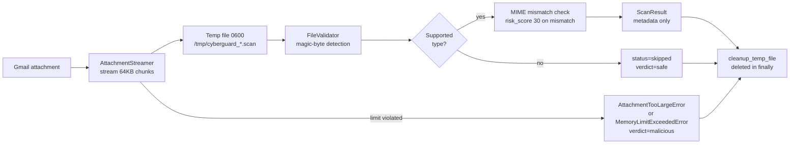

# Attachment Scanning — Phase 1 (Memory-Safe Foundation)

ATTACH-SCAN Phase 1 delivers the resource-bounded foundation every later
scanner level builds on: streamed download, magic-byte type detection, MIME
mismatch scoring, and guaranteed ephemeral cleanup.

## Architecture

Flow: **stream → temp file → scan (in place) → delete**. The attachment
never exists as a single in-memory object and is never persisted.

## Memory-safety guarantees

1. **Streaming download** — `GmailClient.stream_attachment` yields ≤64 KB
   chunks (`STREAM_CHUNK_SIZE`); the streamer writes each chunk straight to
   disk and feeds the hasher. Peak memory stays at chunk size regardless of
   attachment size.
2. **Hard size cap** — rejected up front when `expected_size` exceeds
   `MAX_ATTACHMENT_SIZE_BYTES` (25 MB), and re-checked on every chunk so a
   lying Content-Length cannot bypass it.
3. **Memory kill switch** — after every chunk the scan's memory growth is
   sampled via psutil (RSS delta from scan start); growth exceeding
   `MEMORY_CRITICAL_THRESHOLD_MB` (1000 MB) aborts the scan with
   `MemoryLimitExceededError`. Growth (not absolute RSS) is measured because
   analysis workers legitimately hold ~1 GB of resident ML models; the kill
   switch must trigger on the scan's own footprint, not the process baseline.
4. **Guaranteed cleanup** — the temp file is deleted on success, skip, and
   failure alike (`finally` in `AttachmentScanner.scan_attachment`; the
   streamer also self-cleans on any streaming error).
5. **Private temp files** — created via `tempfile.mkstemp` with `0600`
   permissions, so only the worker process can read the (possibly malicious)
   payload while it is being inspected.

Example: scanning a 25 MB attachment peaks well under 100 MB RSS because the
only resident state is one 64 KB chunk plus the sha256 hasher.

## Resource limits

| Limit | Value | Enforced at |
| --- | --- | --- |
| `MAX_ATTACHMENT_SIZE_BYTES` | 25,000,000 | `stream_to_temp_file` (pre-check + per chunk) |
| `MAX_ATTACHMENTS_PER_EMAIL` | 10 | email-level loop (Phase 2 wiring) |
| `MAX_ARCHIVE_DEPTH` | 3 | Phase 2 (archive inspection) |
| `MAX_EXTRACTED_FILES` | 50 | Phase 2 (archive inspection) |
| `MAX_EXTRACTED_TOTAL_SIZE` | 50,000,000 | Phase 2 (archive inspection) |
| `STREAM_CHUNK_SIZE` | 65,536 | streamer + hashing |
| `MEMORY_CRITICAL_THRESHOLD_MB` | 1000 | streamer per-chunk RSS check |

## Supported MIME types

`application/pdf`, `application/msword`, Word/Excel/PowerPoint OOXML
(`.docx`/`.xlsx`/`.pptx`), legacy `.xls`/`.ppt`, `application/zip`,
`application/x-rar-compressed`, `application/vnd.rar`,
`application/x-7z-compressed`, `application/x-tar`, `application/gzip`,
`image/jpeg`, `image/png`, `image/webp`, `image/gif`, `text/html`,
`text/plain`.

Detection is content-based: the first 16 bytes are matched against
`MAGIC_SIGNATURES` (PDF, ZIP, MZ/PE, GZIP, 7Z, RAR, OLE2, PNG, JPEG, GIF87a/89a,
RIFF/WEBP, tar), falling back to extension guess. Anything unsupported is
**skipped** (`status="skipped"`, `verdict="safe"`, info indicator) — never
scanned, never executed.

## Persistence model

`ProcessedEmail.attachments_meta` (JSON) stores per attachment:
`attachment_id`, `filename`, `mime_type` (declared), `size_bytes`,
`scan_status`, and `scan_results` (status, risk_score, verdict, indicators,
sha256, detected/declared MIME, mime_mismatch, scan_duration_ms).
**Attachment files are NEVER stored** — only this metadata survives the scan.

## Phase 1 scope

- Level 1 only: streamed download + sha256, type detection, MIME mismatch
  scoring (+30 risk), oversized rejection (verdict `malicious`, risk 100).
- Levels 2 (archive inspection), 3 (static analysis), and 4 (sandbox
  detonation) are Phase 2-4 hooks behind `_level1_basic_validation`.
- Not yet wired into the live email pipeline; `scan_attachment` is the
  integration point for the fetch/analysis workers.

Key files:

| File | Role |
| --- | --- |
| `app/core/attachment_limits.py` | All limits, magic signatures, MIME/extension tables |
| `app/core/errors.py` | Attachment error hierarchy |
| `app/services/attachment_streamer.py` | Streaming download to 0600 temp file |
| `app/services/file_validator.py` | Detection + MIME validation + streaming hash |
| `app/services/attachment_scanner.py` | Scan orchestration + cleanup guarantees |
| `app/services/gmail/client.py` | `stream_attachment` (chunked Gmail download) |
