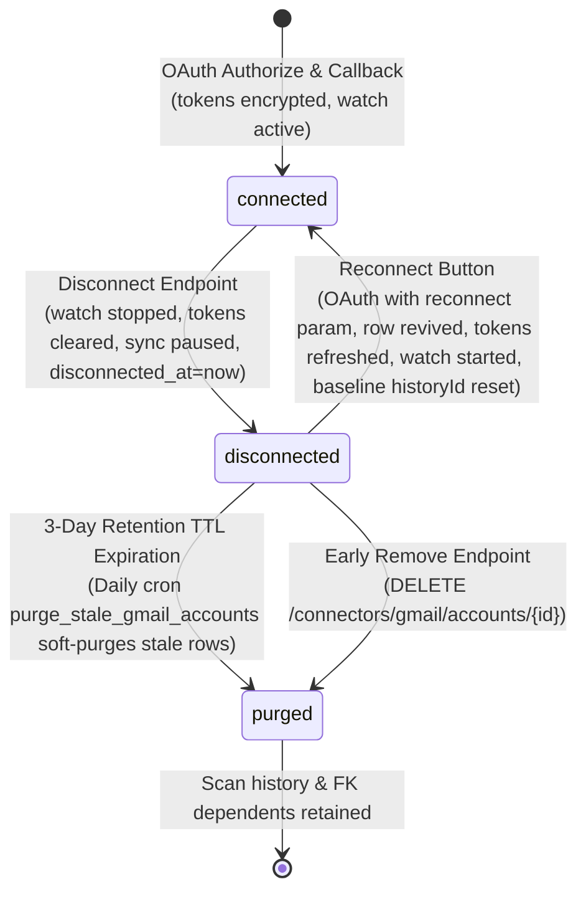

# Gmail Account Connection & Lifecycle Architecture

## 1. Lifecycle State Machine

A Gmail mailbox connected to CYBERGUARD moves through three mutually exclusive states: `connected`, `disconnected`, and `purged`.



### State Definitions
- **`connected`**: Mailbox is actively integrated. Stored tokens are encrypted at rest; Google Pub/Sub push watch is active; sync worker processes inbound webhook notifications; account renders in **Connected Accounts**.
- **`disconnected`**: Mailbox access has been revoked by user action. Google watch is stopped via `gmail.users.stop`; OAuth credentials are revoked at Google and removed from CYBERGUARD storage; sync is paused; `disconnected_at` timestamp is set. The account is absent from Connected Accounts and enters the **Recently Connected** folder for a 3-day TTL window.
- **`purged`**: Account exceeded the 3-day retention window or was removed early by the user. Row remains in database with `status = 'purged'` to preserve FK integrity for `processed_emails`, scan verdicts, and incident logs. Omitted entirely from both Connected and Recently Connected views.

---

## 2. API Endpoints

### 2.1 Authorization & Reconnect
- **`POST /connectors/gmail/authorize`**
  - **Payload**: `{"redirect_after": string, "reconnect": "<account_id>"}` (all optional)
  - **Behavior**: Encodes `reconnect` account ID into the state parameter (`:rec:<id>`). Returns Google OAuth consent URL with `access_type=offline` and `prompt=consent`.

- **`GET /connectors/gmail/callback`**
  - **Parameters**: `code`, `state`
  - **Behavior**: Consumes state. If state includes `:rec:<id>`, revives that specific disconnected account (`status='connected'`, `disconnected_at=None`, stores fresh tokens). Invokes `gmail.users.watch`, stores new `watch_expiration`, and stamps `last_history_id = new_history_id` as the baseline.

### 2.2 Account Listing
- **`GET /connectors/gmail/accounts`**
  - **Query Parameters**: `now` (ISO timestamp for testing/clock override)
  - **Headers**: `X-Test-Now`
  - **Response**:
    ```json
    {
      "connected": [
        {
          "id": "acc-123",
          "email": "user@example.com",
          "status": "connected",
          "last_sync_at": "2026-09-22T10:00:00Z"
        }
      ],
      "recent": [
        {
          "id": "acc-456",
          "email": "old@example.com",
          "status": "disconnected",
          "disconnected_at": "2026-09-21T08:00:00Z",
          "removes_at": "2026-09-24T08:00:00Z"
        }
      ]
    }
    ```
  - **Invariants**: Disconnected rows never appear under `connected`. Rows disconnected > 3 days are excluded from `recent`. Sensitive tokens are never returned.

### 2.3 Disconnection
- **`POST /connectors/gmail/accounts/{account_id}/disconnect`**
- **`POST /gmail/disconnect`**
  - **Behavior**: Idempotent. Calls `gmail.users.stop` (or mock), revokes tokens at Google, nulls encrypted tokens in DB, sets `status = 'disconnected'`, `disconnected_at = now()`, and `sync_status = 'paused'`. Synchronizes corresponding `EmailConnectorAccount` to `status = 'revoked'`.
  - **Pub/Sub Safety**: Never deletes or modifies shared GCP Pub/Sub topics or subscriptions.

### 2.4 Early Removal
- **`DELETE /connectors/gmail/accounts/{account_id}`**
  - **Behavior**: Transitions a `disconnected` account immediately to `purged`.
  - **Constraints**:
    - If `status == 'connected'`: returns `409 Conflict`.
    - If account not found or belongs to another user: returns `404 Not Found`.

### 2.5 Status Inspection
- **`GET /gmail/status`**
  - **Behavior**: Returns current connection status (`connected: true/false`, `email`, `status: "connected"|"disconnected"`) without leaking tokens.

---

## 3. Worker Guards & History Baseline Protection

### 3.1 Pub/Sub Push Webhook Guard
In `app/api/routes_gmail_webhook.py`:
```python
if getattr(account, "status", "connected") != "connected" or not account.refresh_token_encrypted:
    return {"status": "ignored", "reason": "account_disconnected"}
```
Inbound notifications for disconnected mailboxes are immediately acknowledged (`200 OK`) with `status="ignored"`. No background sync job is created.

### 3.2 Sync Worker Guard
In `app/services/gmail/sync_service.py` and `app/workers/gmail_worker.py`:
Accounts whose status is not `connected` or whose credentials have been cleared abort immediately without scanning.

### 3.3 History Baseline Reset on Reconnect
When an account is disconnected for days, re-establishing Pub/Sub notifications without resetting the history ID would cause the sync worker to query Gmail history from the pre-disconnect `last_history_id`, replaying hundreds of missed emails.
On reconnect callback:
1. `GmailClient.watch()` executes.
2. The fresh `historyId` from the Google watch response is recorded directly into `account.last_history_id`.
3. Pre-disconnect history is skipped; only new messages arriving after reconnection trigger security analysis.

---

## 4. Retention & Purge Semantics

1. **Retention Period**: Disconnected accounts remain visible in the "Recently Connected" folder for 72 hours (3 days).
2. **Scheduled Purge**: Daily cron job `purge_stale_gmail_accounts` runs in the scheduler worker (`app/workers/scheduler_worker.py`).
3. **Soft-Purge Strategy**:
   - `processed_emails.gmail_account_id` has `ON DELETE CASCADE`.
   - Hard-deleting rows would destroy historical forensic evidence, threat indicators, risk scores, and audit logs.
   - Stale rows are soft-purged to `status = 'purged'`.
   - Purged rows are excluded from connector listings while preserving security analysis history.
