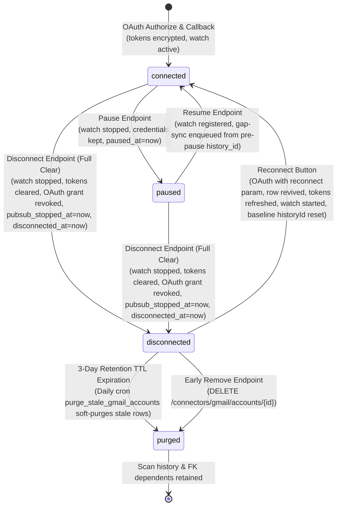

# Gmail Account Connection & Lifecycle Architecture

## 1. Lifecycle State Machine

A Gmail mailbox connected to CYBERGUARD moves through four lifecycle states: `connected`, `paused`, `disconnected`, and `purged`.



### State Definitions
- **`connected`**: Mailbox is actively integrated. Stored tokens are encrypted at rest; Google Pub/Sub push watch is active; sync worker processes inbound webhook notifications; account renders in **Connected Accounts** with `[CONNECTED]` (green) badge and `[Pause Sync]` button toggle.
- **`paused`**: Live synchronization is temporarily halted by user request. Watch is stopped at Google via `gmail.users.stop`; credentials and pre-pause `last_history_id` are preserved; `paused_at` timestamp is set; renewal cron ignores this row; inbound pushes are dropped and ACKed by the worker guard. Renders in **Connected Accounts** with `[PAUSED]` (amber) badge and `[Resume Sync]` button toggle.
- **`disconnected`**: Mailbox access has been revoked by user action (Full Clear). Google watch is stopped via `gmail.users.stop`; OAuth credentials are revoked at Google and removed from CYBERGUARD storage; `last_history_id` and `watch_expiration` are NULLed; `pubsub_stopped_at` and `disconnected_at` timestamps are stamped; sync is paused. Shared Pub/Sub topics/subscriptions remain untouched (backlog drained by worker guard ACK-drop). The account enters the **Recently Connected** folder for a 3-day TTL window.
- **`purged`**: Account exceeded the 3-day retention window or was removed early by the user. Row remains in database with `status = 'purged'` to preserve FK integrity for `processed_emails`, scan verdicts, and incident logs. Omitted entirely from both Connected and Recently Connected views.

---

## 2. API Endpoints

### 2.1 Authorization & Reconnect
- **`POST /connectors/gmail/authorize`**
  - **Payload**: `{"redirect_after": string, "reconnect": "<account_id>"}` (all optional)
  - **Behavior**: Encodes `reconnect` account ID into the state parameter (`:rec:<id>`). Returns Google OAuth consent URL with `access_type=offline` and `prompt=consent`.

- **`GET /connectors/gmail/callback`**
  - **Parameters**: `code`, `state`
  - **Behavior**: Consumes state. If state includes `:rec:<id>`, revives that specific disconnected account (`status='connected'`, `disconnected_at=None`, `paused_at=None`, `pubsub_stopped_at=None`, stores fresh tokens). Invokes `gmail.users.watch`, stores new `watch_expiration`, and stamps `last_history_id = new_history_id` as the baseline.

### 2.2 Account Listing
- **`GET /connectors/gmail/accounts`**
  - **Query Parameters**: `now` (ISO timestamp for testing/clock override)
  - **Headers**: `X-Test-Now`
  - **Response**:
    ```json
    {
      "connected": [
        {
          "id": "acc-123",
          "email": "user@example.com",
          "status": "connected",
          "last_sync_at": "2026-09-22T10:00:00Z"
        },
        {
          "id": "acc-124",
          "email": "paused-user@example.com",
          "status": "paused",
          "paused_at": "2026-09-22T11:00:00Z"
        }
      ],
      "recent": [
        {
          "id": "acc-456",
          "email": "old@example.com",
          "status": "disconnected",
          "disconnected_at": "2026-09-21T08:00:00Z",
          "removes_at": "2026-09-24T08:00:00Z"
        }
      ]
    }
    ```
  - **Invariants**: Disconnected rows never appear under `connected`. Active `connected` and `paused` rows appear in `connected`. Rows disconnected > 3 days are excluded from `recent`. Sensitive tokens are never returned.

### 2.3 Disconnection (Full Clear)
- **`POST /connectors/gmail/accounts/{account_id}/disconnect`**
- **`POST /gmail/disconnect`**
  - **Google Actions**: Calls `gmail.users.stop()` to cancel Google Cloud Pub/Sub push delivery; revokes OAuth token via Google revocation endpoint (`https://oauth2.googleapis.com/revoke`).
  - **App Actions**: NULLs `access_token_encrypted`, `refresh_token_encrypted`, `last_history_id`, `watch_expiration`; sets `pubsub_stopped_at = now()`, `disconnected_at = now()`, `paused_at = None`, `status = 'disconnected'`, and `sync_status = 'paused'`. Synchronizes corresponding `EmailConnectorAccount` to `status = 'revoked'`.
  - **Pub/Sub Safety**: Shared Pub/Sub topics and subscriptions are NEVER deleted. Backlog messages are safely drained and ACKed by the worker guard.
  - **Idempotency**: Safe to call repeatedly without error.

### 2.4 Pause and Resume
- **`POST /connectors/gmail/accounts/{account_id}/pause`** and **`POST /connectors/gmail/pause`**
  - **Behavior**: Calls `gmail.users.stop()` at Google to cease notifications. Preserves OAuth tokens and pre-pause `last_history_id`. Sets `paused_at = now()`, `status = 'paused'`, `sync_status = 'paused'`.
  - **Idempotency**: Calling pause on an already paused account is a no-op returning `200 OK`.
- **`POST /connectors/gmail/accounts/{account_id}/resume`** and **`POST /connectors/gmail/resume`**
  - **Behavior**: Calls `gmail.users.watch()` at Google. Updates `watch_expiration` and `last_history_id`. Clears `paused_at = None`, sets `status = 'connected'`, `sync_status = 'active'`.
  - **Gap Catch-Up**: Enqueues a `gmail_sync` background job using the pre-pause `last_history_id` to retrieve messages received while paused.
  - **Conflict**: Returns `409 Conflict` if the account is already connected.

### 2.5 Early Removal
- **`DELETE /connectors/gmail/accounts/{account_id}`**
  - **Behavior**: Transitions a `disconnected` account immediately to `purged`.
  - **Constraints**:
    - If `status == 'connected'` or `status == 'paused'`: returns `409 Conflict`.
    - If account not found or belongs to another user: returns `404 Not Found`.

### 2.6 Status Inspection
- **`GET /gmail/status`**
  - **Behavior**: Returns current connection status (`connected: true/false`, `email`, `status: "connected"|"paused"|"disconnected"`) without leaking tokens.

---

## 3. Worker Guards & Watch Maintenance

### 3.1 Pub/Sub Push Webhook Guard & Plateau Check
In `app/api/routes_gmail_webhook.py`:
- Updates `account.last_push_at = now()` on every inbound notification for diagnostic tracking.
- If `status in ('disconnected', 'purged')`: logs distinct drop reason and returns `200 OK` (`reason="account_disconnected"`). Google will not retry.
- If `refresh_token` is missing: drops and ACKs (`reason="no_refresh_token"`).
- If `status == 'paused'` or `sync_status == 'paused'`: logs distinct drop reason and returns `200 OK` (`reason="account_paused"`).
- Once Google confirms watch stoppage, push notifications cease and `last_push_at` plateaus (stops updating).

### 3.2 Renewal Cron Filtering
In `app/services/gmail/watch_service.py` (`renew_watches`):
- Filter query: `where(GmailAccount.status == 'connected')`
- Skips `paused` (watch deliberately stopped) and `disconnected` mailboxes.
- Prevents accidental watch re-registration for paused or disconnected accounts.

---

## 4. Retention & Purge Semantics

1. **Retention Period**: Disconnected accounts remain visible in the "Recently Connected" folder for 72 hours (3 days).
2. **Scheduled Purge**: Daily cron job `purge_stale_gmail_accounts` runs in the scheduler worker (`app/workers/scheduler_worker.py`).
3. **Soft-Purge Strategy**:
   - `processed_emails.gmail_account_id` has `ON DELETE CASCADE`.
   - Hard-deleting rows would destroy historical forensic evidence, threat indicators, risk scores, and audit logs.
   - Stale rows are soft-purged to `status = 'purged'`.
   - Purged rows are excluded from connector listings while preserving security analysis history.
