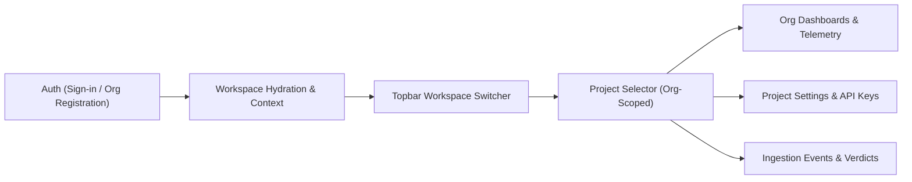

# 📐 CYBERGUARD — Organization UI Redesign Brief
**Scope: Auth to Project Selector & Multi-Tenant Management**
**Document Version:** 1.0 (Post-Teardown Baseline)
**Date:** September 2026

---

## 1. Executive Summary & Design System Foundations

The organization UI surfaces were cleanly torn down to prepare for a comprehensive redesign from authentication through the project selector.
The design system, color palette, component primitives, styling tokens, and personal/client workspace remain **100% intact**.

### 1.1 Strict Color Tokens & Surfaces
CYBERGUARD utilizes a strict monochrome and crimson threat palette:

| Token / Layer | Hex Value | Semantic Role |
|---|---|---|
| **Page Canvas** | `#050505` (`zinc-950`) | Deep black background canvas |
| **Panels** | `#0a0a0a` (`zinc-900`) | Main container background, sidebars, headers |
| **Cards & Inputs** | `#101010` (`zinc-900/60` / `bg-surface`) | Interactive surfaces, cards, input backgrounds |
| **Borders & Dividers** | `#262626` (`zinc-800` / `border-border`) | Surface separation, card outlines, subtle dividers |
| **Text Primary** | `#fafafa` (`zinc-50`) | Main titles, active values, high-contrast labels |
| **Text Secondary** | `#a3a3a3` (`zinc-400`) | Secondary descriptions, disabled states, placeholders |
| **Text Muted** | `#71717a` (`zinc-500`) | Captions, timestamps, mono metadata |
| **Primary Accent** | `#dc2626` (`red-600`) | Primary actions, key callouts, active navigation indicators |
| **Accent Hover** | `#ef4444` (`red-500`) | Hover state for buttons, animated threat pulses |

### 1.2 Severity Spectrum
Standardized 5-tier threat ramp (`SEVERITY_RAMP` in `frontend/src/theme.ts`):
- **Safe**: `#e4e4e7` (zinc-200, black text)
- **Low**: `#71717a` (zinc-500, white text)
- **Medium**: `#f87171` (red-400, black text)
- **High**: `#dc2626` (red-600, white text)
- **Critical**: `#ef4444` (red-500, white text + subtle pulse ring)

### 1.3 Typography & Spacing
- **Sans font:** `Inter, system-ui, -apple-system, sans-serif`
- **Mono font:** `JetBrains Mono, Fira Code, ui-monospace, Menlo, monospace`
- **Topbar height:** `h-14` (56px) with `backdrop-blur`
- **Sidebar width:** `w-64` expanded (256px), `w-16` collapsed (64px)

---

## 2. Shared Component Catalog (Reused by Redesign)

All shared components reside in [frontend/src/components/common/](file:///home/srikant/hackthon/Hack_thon_bput/frontend/src/components/common) and layout components in [frontend/src/components/layout/](file:///home/srikant/hackthon/Hack_thon_bput/frontend/src/components/layout):

| Component | Source File | Core Props & Capabilities |
|---|---|---|
| [`AuthErrorBanner`](file:///home/srikant/hackthon/Hack_thon_bput/frontend/src/components/common/AuthErrorBanner.tsx) | `common/AuthErrorBanner.tsx` | `errorInfo: AuthErrorInfo \| null`, `onAction?: () => void`. Handles 409 email collision banners with context-aware CTA ("Sign in instead", "Check pending invite"). |
| [`DataTable`](file:///home/srikant/hackthon/Hack_thon_bput/frontend/src/components/common/DataTable.tsx) | `common/DataTable.tsx` | `columns: Column<T>[]`, `data: T[]`, `rowKey`, `onRowClick?`, `emptyMessage?`, `loading?`. Generic sortable table. |
| [`SeverityBadge`](file:///home/srikant/hackthon/Hack_thon_bput/frontend/src/components/common/SeverityBadge.tsx) | `common/SeverityBadge.tsx` | `severity: Severity`, `size?: 'sm' \| 'md'`, `showDot?: boolean`. Threat level badge matching theme ramp. |
| [`StatusPill`](file:///home/srikant/hackthon/Hack_thon_bput/frontend/src/components/common/StatusPill.tsx) | `common/StatusPill.tsx` | `status: string`, `variant?: 'default' \| 'live' \| 'dot'`. Renders status pills including LIVE pulsating badge. |
| [`StatCard`](file:///home/srikant/hackthon/Hack_thon_bput/frontend/src/components/common/StatCard.tsx) | `common/StatCard.tsx` | `title: string`, `value: string \| number`, `icon: LucideIcon`, `trend?`, `trendValue?`, `color?`. Metric tile. |
| [`ChartCard`](file:///home/srikant/hackthon/Hack_thon_bput/frontend/src/components/common/ChartCard.tsx) | `common/ChartCard.tsx` | `title: string`, `subtitle?: string`, `children`, `action?`. Container for Recharts graphs. |
| [`RiskGauge`](file:///home/srikant/hackthon/Hack_thon_bput/frontend/src/components/common/RiskGauge.tsx) | `common/RiskGauge.tsx` | `score: number (0-100)`, `size?`, `showLabel?`. Radial SVG threat score indicator. |
| [`EmptyState`](file:///home/srikant/hackthon/Hack_thon_bput/frontend/src/components/common/EmptyState.tsx) | `common/EmptyState.tsx` | `icon: LucideIcon`, `title: string`, `description: string`, `action?`. Standard empty list view. |
| [`PageHeader`](file:///home/srikant/hackthon/Hack_thon_bput/frontend/src/components/common/PageHeader.tsx) | `common/PageHeader.tsx` | `title: string`, `description?: string`, `badge?`, `actions?`. Unified title bar. |
| [`Toast`](file:///home/srikant/hackthon/Hack_thon_bput/frontend/src/components/common/Toast.tsx) | `common/Toast.tsx` | `message: string`, `severity: Severity`, `onClose`. Floating alerts via `uiStore`. |
| [`PanelSkeleton`](file:///home/srikant/hackthon/Hack_thon_bput/frontend/src/components/common/LoadingSkeleton.tsx) | `common/LoadingSkeleton.tsx` | `height?`, `className?`. Pulse loading skeleton. |
| [`Topbar`](file:///home/srikant/hackthon/Hack_thon_bput/frontend/src/components/layout/Topbar.tsx) | `layout/Topbar.tsx` | Base shell: 56px border-b, title, CLOUD SOC badge, Live Alerts pulse toggle, Operator user menu. |
| [`Sidebar`](file:///home/srikant/hackthon/Hack_thon_bput/frontend/src/components/layout/Sidebar.tsx) | `layout/Sidebar.tsx` | Base shell: 256px / 64px collapsible navigation with active indicator borders. |

---

## 3. Removed Org Surface Inventory (Redesign Scope)

The upcoming redesign spans the complete flow from **authentication to project selection**:



### 3.1 Mapping of Surfaces Removed in Teardown

| Surface | Original Location | Target Scope in Redesign |
|---|---|---|
| **Org Tab / Registration** | `Login.tsx` | Clean, dedicated Org Auth flow with seamless onboarding and company domain detection |
| **Workspace Switcher** | `Topbar.tsx` | Accessible dropdown in Topbar for toggling between Personal and Org workspaces |
| **Project Selector** | `Topbar.tsx` | Org-scoped project selector (Master / Default project with key access) |
| **Org Dashboard** | `OrgDashboard.tsx` (`/org/dashboard`) | High-level telemetry aggregation, threat breakdown, active incident queues |
| **Org Events & Review** | `OrgEventsList.tsx`, `OrgEventReview.tsx` (`/org/events`, `/org/.../events/...`) | Ingestion stream, review drawer, manual verdict actions (Release, Block, False Positive) |
| **Project Settings** | `OrgProjectSettings.tsx` (`/org/settings`) | API key lifecycle (slots), blocked indicators list, team invitation management |
| **Plaintext-Once Key Modal** | `OrgProjectSettings.tsx` | Reusable modal with secret copy action and mandatory confirmation checkbox |
| **Invite Member Modal** | `OrgProjectSettings.tsx` | Team member invitation with role assignment (Admin, Analyst, Viewer) |

---

## 4. Key Interaction Patterns to Reuse

1. **Plaintext-Once API Key Modal**:
   - Generates API keys where the secret token is shown strictly once.
   - Includes full string click-to-copy with visual checkmark transition.
   - Enforces a required checkbox confirmation (`I have securely stored this key...`) before the modal can be dismissed.
2. **LIVE Telemetry Pill**:
   - `<span className="rounded-full bg-emerald-500/10 text-emerald-400 border border-emerald-500/20 px-2 py-0.5 font-mono text-[10px] animate-pulse">LIVE</span>`
   - Realtime WebSocket / Supabase Broadcast status indicator with reconnection fallback.
3. **Graceful 409 Conflict Handling**:
   - Ingestion and auth endpoints return 409 with custom error codes (`email_exists`, `indicator_collision`).
   - UI catches `AuthApiError` and renders the structured `AuthErrorBanner` without hard crashes.
4. **Realtime Hook Pattern**:
   - Supabase realtime channel subscription on mount, payload deduplication via Set/Map of processed IDs, optimistic counter increment, clean unmount cleanup.

---

## 5. Backend API Contract Summary (Redesign Ready)

The backend is 100% intact, healthy, and isolated. The redesign will integrate with the following existing endpoints:

### 5.1 Authentication & Workspace Ingestion
- `POST /api/v1/auth/register-org`:
  - Request: `{"email": str, "password": str, "org_name": str, "name": str?, "username": str?}`
  - Response: `{ "user": User, "organization": { "id", "name", "role" }, "project": { "id", "name", "slug" }, "memberships": [...], "session": Token }`
- `GET /api/v1/auth/me`:
  - Response includes: `{ "org_enabled": bool, "active_role": str, "active_organization": Org, "active_project": Project, "memberships": [...] }`
- `POST /api/v1/auth/switch-org`:
  - Request: `{"organization_id": str}`
- `POST /api/v1/auth/switch-project`:
  - Request: `{"project_id": str}`

### 5.2 Organizations & Projects
- `GET /api/v1/orgs`: List user's organizations
- `GET /api/v1/orgs/{org_id}`: Organization details
- `GET /api/v1/orgs/{org_id}/projects`: List projects in organization
- `POST /api/v1/orgs/{org_id}/projects`: Create project
- `GET /api/v1/orgs/{org_id}/projects/{project_id}/api-keys`: List project API keys
- `POST /api/v1/orgs/{org_id}/projects/{project_id}/api-keys`: Create master or viewer key (returns plaintext `api_key` once)
- `DELETE /api/v1/orgs/{org_id}/projects/{project_id}/api-keys/{key_id}`: Revoke key

### 5.3 Ingestion Events & Telemetry
- `GET /api/v1/orgs/{org_id}/events`: List security events with filtering (`severity`, `verdict`, `project_id`)
- `GET /api/v1/orgs/{org_id}/events/{event_id}`: Detailed event review & raw payload
- `POST /api/v1/orgs/{org_id}/events/{event_id}/verdict`: Update verdict (`released`, `blocked_permanently`, `false_positive`)
- `GET /api/v1/orgs/{org_id}/counters/initial`: Seed counters for telemetry widgets
- **Supabase Realtime Channel**: `org:{org_id}:counters` (subscribes to broadcast updates)

---

## 6. Personal Workspace Baseline References (Screenshot-as-Text)

These baselines record the visual layout of the intact personal surfaces as theme references:

### Dashboard (`/dashboard`)
```text
- main:
  - heading "Security Operations Center" [level=2]
  - paragraph: Real-time threat monitoring, detection and response overview. Auto-refreshes every 30 seconds.
  - text: Events Analyzed 0 (+12% vs last week)
  - text: Threats Detected 0 (+8% vs last week)
  - text: Phishing Attempts 0 (+15% vs last week)
  - text: Impersonation Attempts 0 (stable)
  - text: Suspected Deepfakes 0 (+5% vs last week)
  - text: Account Takeover Attempts 0 (-3% vs last week)
  - heading "Risk Distribution"
  - heading "Threat Categories"
  - heading "Attack Timeline — Last 24 Hours"
  - heading "Incident Summary" (open, investigating, contained, closed)
  - heading "Top Targeted Users"
  - heading "Top Targeted Services"
  - heading "Recent Alerts"
```

### Phishing Analysis (`/phishing`)
```text
- main:
  - heading "AI-Powered Phishing Detection" [level=2]
  - paragraph: Analyze emails for phishing, social engineering and credential harvesting using heuristic indicators.
  - heading "Email Content" [level=3]
  - text: Sender Address [textbox "sender@example-domain.com"]
  - text: Subject [textbox "Email subject line"]
  - text: Email Body [textbox "Paste the full email body here..."]
  - button "Advanced — supply raw message headers optional"
  - button "Load Benign Sample"
  - button "Load Phishing Sample"
  - button "Analyze Email"
```

### Quarantine Queue (`/quarantine`)
```text
- main:
  - heading "Quarantine Queue" [level=2]
  - paragraph: Messages quarantined at Gmail by auto-enforcement.
  - text: LIVE
  - heading "Quarantined messages (0 active)" [level=2]
  - button "Refresh"
  - text: Nothing quarantined yet. Run a mailbox scan from Email Connectors...
```

### Security History (`/security-history`)
```text
- main:
  - heading "Security History" [level=2]
  - paragraph: Permanent record of real security events and provider operations...
  - combobox "Event" (All events, scan verdict, quarantine, release, keep, delete, sender block, etc.)
  - combobox "Severity" (All severities, critical, high, medium, low, safe)
  - button "Clear filters"
  - button "Refresh"
  - text: No events match the current filter.
```

### Settings (`/settings`)
```text
- main:
  - heading "Settings" [level=2]
  - paragraph: Profile, environment and detection reference configuration.
  - heading "Email Notifications" [level=3]
  - text: alerts@yourdomain.com [button "Save"]
  - heading "Profile" [level=3]
  - text: Name: Test User | Email: testuser@cyberguard.local | Role: admin
  - heading "Backend Connection" [level=3]
  - text: REST API: Connected (Cloud SOC) | Mode: Enterprise Live
```
