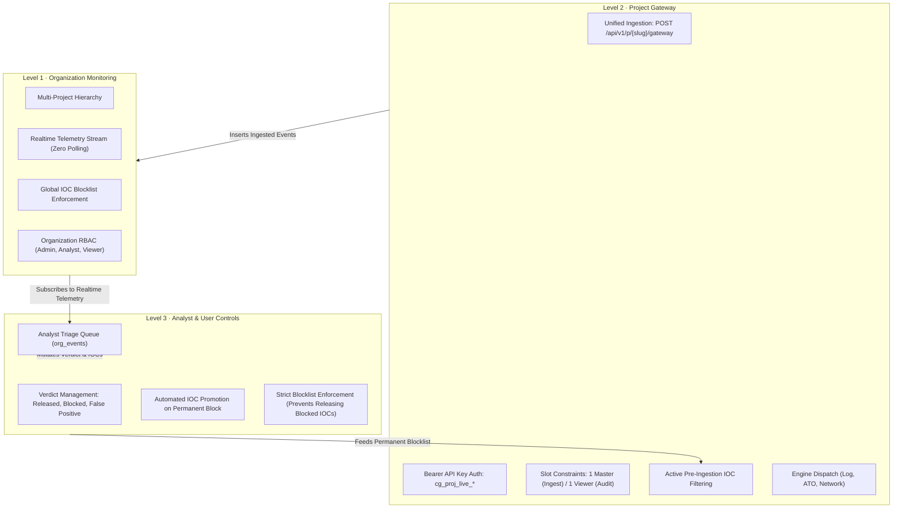

# Organization Architecture Rebuild (ORG-REBUILD)

## 1. Architectural Overview

The organization system is architected around a strict 3-level operational hierarchy designed for multi-tenant security operations, automated gateway ingestion, and analyst triage:



---

## 2. Database Schema & Migration (`0100_org_rebuild.py`)

### 2.1 Dropped Legacy Tables
The teardown phase dropped the fragmented legacy tables in the `cyberguard` schema:
- `org_feature_dashboards`
- `org_log_entries`
- `org_mail_server_logs`
- `org_mail_servers`
- `org_notification_group_members`
- `org_notification_groups`
- `org_notification_logs`

### 2.2 Newly Created Tables
The rebuild introduces 6 purpose-built tables under the `cyberguard` schema:
1. `org_organizations`: Multi-tenant organization boundaries, owner references, and status.
2. `org_members`: User membership mapped to roles (`admin`, `analyst`, `viewer`).
3. `org_projects`: Project workspaces within an organization, featuring human-readable unique slugs.
4. `org_api_keys`: Scoped API keys with SHA-256 hash storage and plaintext returned exactly once upon creation. Enforces slot invariants: maximum 1 active `master` and 1 active `viewer` key per project.
5. `org_events`: Central telemetry and event ledger containing raw data, analyzer intelligence, verdicts, and analyst action metadata.
6. `org_blocked_indicators`: Permanent indicators of compromise (IOCs: `ip`, `domain`, `email`, `hash`, `actor`) applied across gateway ingestion and triage workflows.

### 2.3 Database Helper Functions & Realtime
- `cyberguard.org_member_role(p_org_id, p_user_id)`: Secure `SECURITY DEFINER` function for resolving member privileges under Row Level Security.
- `cyberguard.validate_org_api_key(p_key_hash, p_project_slug)`: High-performance definer function validating project keys directly at the database gateway.
- `ALTER PUBLICATION supabase_realtime ADD TABLE cyberguard.org_events;`: Enables native Postgres CDC (Change Data Capture) push notifications for real-time live telemetry counters.

---

## 3. The Three Analyzers & Uniform Schema

Three modular analyzers reside in `backend/app/services/org_analyzers/`:

| Analyzer | Engine Identifier | Scope / Logic |
| :--- | :--- | :--- |
| **Log Analyzer** | `regex_rules` | Detects auth failures, brute force attacks, privilege escalation, and suspicious syslog commands via deterministic regex rules. |
| **Account Takeover (ATO)** | `heuristic_rules` | Identifies credential stuffing, impossible travel, and automated token brute force patterns across login sequences. |
| **Network Threat Analyzer** | `zeek_suricata_rules` | Inspects connection flows for known C2 ports (4444, 1337, etc.), DNS tunneling, and outbound data volume anomalies. |

### Uniform Output Contract
Every analyzer conforms strictly to the uniform dictionary schema:
```json
{
  "risk_score": 0.85,
  "severity": "critical",
  "indicators": [
    { "type": "ip", "value": "198.51.100.23" }
  ],
  "mitre": ["T1110", "T1078"],
  "engine": "regex_rules",
  "available": true
}
```
If an analyzer engine is unavailable, it reports `"available": false` and the gateway returns `501 Not Implemented`.

---

## 4. Gateway Authentication & Public API Surface

### Unified Gateway Route
- **Route**: `POST /api/v1/p/{project_slug}/gateway`
- **Auth**: `Authorization: Bearer <cg_proj_live_...>`
- **Behavior**:
  - Validates key hash and project slug via database definer function.
  - Rejects `viewer` keys with `403 Forbidden` (read-only audit keys).
  - Rejects inactive or archived projects with `404 Not Found`.
  - Rejects unavailable or unsupported analyzers with `501 Not Implemented`.
  - Performs pre-ingestion IOC matching against `org_blocked_indicators`: if any input indicator is blocked, the event is immediately flagged and recorded with verdict `blocked_permanently`.
  - Commits event into `org_events` and publishes live update via Supabase Realtime.

### Session APIs (JWT Session Scoped)
All management operations require authenticated JWT sessions:
- Organizations & Members: `/api/v1/orgs`, `/api/v1/orgs/{org_id}/members`
- Projects: `/api/v1/orgs/{org_id}/projects`
- API Key Slots: `/api/v1/orgs/{org_id}/projects/{project_id}/keys`
- Events & Verdicts: `/api/v1/orgs/{org_id}/projects/{project_id}/events/{event_id}`
- Blocked Indicators: `/api/v1/orgs/{org_id}/blocked-indicators`
- Initial Seed Counters: `/api/v1/orgs/{org_id}/projects/{project_id}/counters/initial`

---

## 5. Realtime Live Counters (Zero Polling Architecture)

Live counters in the frontend use Supabase Realtime Postgres CDC subscriptions:
1. **Initial Seed Fetch**: On mount or project switch, client makes a single HTTP call to `GET /counters/initial`.
2. **Realtime CDC Subscription**: Subscribes to channel `org-counters-{project_id}` listening for:
   - `INSERT` on `cyberguard.org_events`: increments `total_24h`, severity breakdown, analyzer breakdown, and `pending_review`.
   - `UPDATE` on `cyberguard.org_events`: decrements `pending_review` when verdict transitions out of pending.
3. **Zero Polling Loops**: `setInterval` and periodic fetching loops are completely eliminated.
4. **Read-Only UI Guarantee**: The Live Counters tab view contains zero form inputs (`<input>`, `<textarea>`, `<select>`, `<form>`), ensuring clean, display-only telemetry.

---

## 6. Personal Workspace Isolation

- The personal workspace (routes `/phishing`, `/url-analysis`, `/impersonation`, `/deepfake`, `/log-analysis`, `/mailbox/*`, `/security-history`) is 100% untouched.
- Core personal engines and pipelines are imported as read-only dependencies without modification.
- Multi-tenancy isolation guarantees that personal data is completely segregated from organization telemetry.
