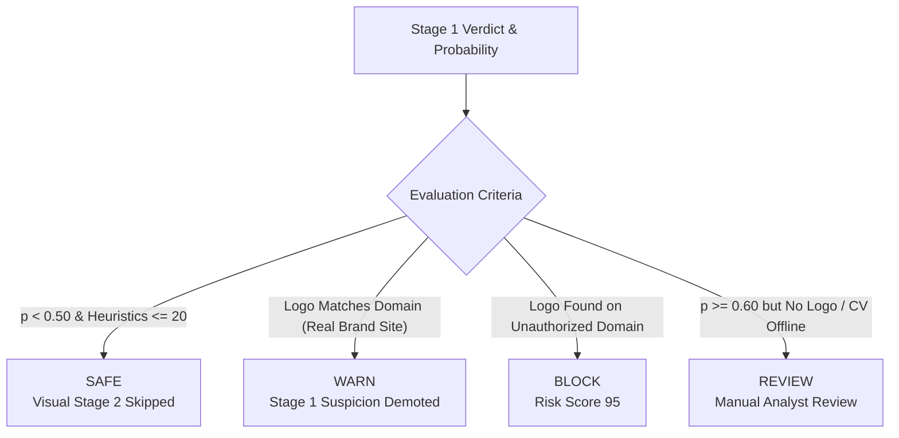

# End-to-End Malicious URL Analysis Workflow

This document specifies the complete, production-grade architecture and operational workflow of the **Malicious URL Forensics & Analysis Engine** in CyberGuard SOC. It covers all ingestion channels, normalization rules, Stage-1 fast-path heuristics and XGBoost ML classification, live domain intelligence, Stage-2 cascaded visual brand verification (Phishpedia), evidence fusion, alert persistence, background LLM explanation generation, and real-time SOC event broadcasting.

---

## 1. High-Level Architecture Overview

The URL analysis system operates a **cascaded, two-stage detection pipeline (`URL-CASCADE`)**:

- **Stage 1 (Inline, Fast Path ~3.7 ms):**
  - Canonical URL normalization preserving attack evidence.
  - 10+ deterministic lexical and structural heuristics.
  - Cisco Umbrella Top-1M domain whitelist & path shape classification.
  - XGBoost machine learning inference (`url_xgb_v4.pkl` / `v3.1`).
  - Monotonic hybrid score blending with an **ML confidence floor**.
  - Optional additive live domain intelligence via Firecrawl (with strict internal IP privacy guards).
- **Stage 2 (Async Offload, Heavy CV ~800–1200 ms):**
  - Triggered only when Stage-1 risk probability $p \ge 0.60$.
  - Executed on a dedicated background Arq worker (`visual-worker`).
  - Faster R-CNN object detector (ONNX / PyTorch) detects logo regions.
  - Siamese neural network creates 512-dimensional logo embeddings.
  - Cosine matching against brand galleries and domain consistency verification.
  - Redis domain-TTL cache (`visual_verdict:<domain>`, 3600s TTL) avoids re-running vision for repeated visits to the same domain.
- **Evidence Fusion & Policy Engine:**
  - Categorical, non-averaging fusion into `SAFE`, `WARN`, `REVIEW`, or `BLOCK`.
  - Severity-to-enforcement mapping with fail-safe defaults.
- **Persistence & SOC Broadcast:**
  - Async SQLAlchemy persistence of `Event`, `Alert`, and `RecommendedAction`.
  - Non-blocking background task generating natural-language explanations and MITRE ATT&CK mappings via OpenRouter LLMs (with fallback to deterministic templates).
  - Real-time websocket/SSE dispatch via Supabase Realtime broadcast.

---

## 2. End-to-End Workflow Diagram

```mermaid
flowchart TD
    %% INGESTION CHANNELS
    subgraph Ingestion ["1. Ingestion Channels"]
        IN_DASH["SOC Web Dashboard<br/>POST /api/v1/analysis/url"]
        IN_EXT["Browser Extension<br/>Active Tab / On-Page Scan"]
        IN_MAIL["Email Scanner Pipeline<br/>mail_scanner.py (Body & HTML)"]
        IN_ATT["Attachment URL Extractor<br/>PDF, Office, HTML Lures"]
    end

    %% PREPROCESSING & NORMALIZATION
    subgraph Preprocessing ["2. Rate Limiting & Normalization"]
        RL["Per-User Rate Limiter<br/>PerUserHTTPRateLimiter"]
        NORM["Evidence-Preserving Normalizer<br/>app.core.url_normalization"]
        PAIR[("Raw & Normalized Pair<br/>Saved in Event raw_data")]
    end

    %% STAGE 1 ENGINE
    subgraph Stage1 ["3. Stage 1: Fast-Path Forensics & ML"]
        LEX["Lexical Heuristics (10+ rules)<br/>app/services/url_detector.py"]
        REP["Reputation & Shape Layer<br/>Cisco Umbrella Top-1M<br/>Path Shape Classification"]
        FEAT["Feature Extractor<br/>ml/url_features_v3.py<br/>(19 / 29 features)"]
        XGB["XGBoost ML Inference<br/>url_xgb_v4.pkl / v3.1<br/>Probability p in [0, 1]"]
        BLEND["Hybrid URL Blend<br/>with ML Confidence Floor<br/>blend_scores_url()"]
    end

    %% LIVE DOMAIN INTEL
    subgraph DomainIntel ["4. Dynamic Domain Intelligence (Firecrawl)"]
        PRIV{"Is Internal / Local Host?<br/>RFC1918, .local, cloud metadata"}
        NO_CRAWL["Flag local_internal_domain<br/>NEVER Crawl (Privacy Guard)"]
        CRAWL["Firecrawl Scrape & Render<br/>Credential Forms & Redirection"]
        LURE["Brand Lookalike Match<br/>Levenshtein + Homoglyphs"]
    end

    %% STAGE 2 CASCADE GATE
    subgraph CascadeGate ["5. Cascade Decision Gate"]
        GATE{"Stage 1 ML Probability<br/>p >= 0.60 ?"}
        CACHE{"Redis Domain TTL Cache Hit?<br/>visual_verdict:registrable_domain"}
        WORKER_Q["Enqueue visual-worker<br/>visual_phish_check (Arq + Redis)"]
    end

    %% STAGE 2 COMPUTER VISION
    subgraph Stage2 ["6. Stage 2: Phishpedia Visual Verification"]
        FRCNN["Faster R-CNN Logo Detector<br/>ONNX / PyTorch (Top-3 Boxes)"]
        SIAM["Siamese Net Embedder<br/>512-dim Embedding Vector"]
        MATCH["Gallery Cosine Match<br/>domain_map.pkl (Threshold 0.80)"]
        CONSIST{"Does Logo Brand Match<br/>Registrable Domain?"}
    end

    %% EVIDENCE FUSION
    subgraph Fusion ["7. Evidence Fusion & Enforcement Policy"]
        FUSE_ENG["Explicit Policy Fusion<br/>app/services/evidence_fusion.py<br/>SAFE · WARN · REVIEW · BLOCK"]
        DEC_ACT["URL Decision Policy<br/>allow · warn · block"]
    end

    %% PERSISTENCE & SOC BROADCAST
    subgraph Output ["8. Persistence, LLM Explanation & Broadcast"]
        DB_EVENT["Create Event<br/>status: analyzing -> completed"]
        DB_ALERT["Create Alert & Actions<br/>Tenant/Org/Project Scoped"]
        BG_LLM["Background OpenRouter Task<br/>LLM Explanation + MITRE Tags<br/>(Heuristic Fallback <= 8s)"]
        BROADCAST["Supabase Realtime Broadcast<br/>org-counters-{project_id}"]
        CLIENTS["Realtime SOC Updates<br/>& Extension Tab Blocking"]
    end

    %% CONNECTIONS
    IN_DASH --> RL
    IN_EXT --> RL
    IN_MAIL --> NORM
    IN_ATT --> NORM

    RL --> NORM
    NORM --> PAIR
    PAIR --> LEX
    PAIR --> REP
    PAIR --> FEAT

    LEX --> BLEND
    REP --> FEAT
    FEAT --> XGB
    XGB --> BLEND

    PAIR --> PRIV
    PRIV -- "Yes" --> NO_CRAWL --> BLEND
    PRIV -- "No" --> CRAWL --> LURE --> BLEND

    BLEND --> GATE
    GATE -- "No (p < 0.60)" --> FUSE_ENG
    GATE -- "Yes (p >= 0.60)" --> CACHE
    CACHE -- "Cache Hit" --> FUSE_ENG
    CACHE -- "Cache Miss" --> WORKER_Q

    WORKER_Q --> FRCNN --> SIAM --> MATCH --> CONSIST --> FUSE_ENG

    FUSE_ENG --> DEC_ACT
    DEC_ACT --> DB_EVENT
    DB_EVENT --> DB_ALERT
    DB_ALERT --> BG_LLM
    DB_ALERT --> BROADCAST
    BROADCAST --> CLIENTS
```



---

## 3. Detailed Phase-by-Phase Execution

### Phase 1: Ingestion & Input Channels

URL analysis can be initiated from four distinct entry points across the CyberGuard platform:

1. **SOC Web Dashboard (`POST /api/v1/analysis/url`):**
   - Security analysts submit URLs directly for ad-hoc inspection.
   - Request payload: `{"url": "...", "source": "web_dashboard"}`.
2. **Browser Extension (`POST /api/v1/analysis/url` & `POST /api/v1/analysis/url/visual`):**
   - **Inline passive scan:** Inspects navigated tabs via `POST /api/v1/analysis/url`. Non-HTTP schemes (`chrome://`, `about:`, `file://`) are ignored.
   - **Visual verification scan:** Captures full-page tab screenshots (base64 PNG) and submits them via `POST /api/v1/analysis/url/visual` for cascaded brand impersonation detection.
3. **Mail Scanner Pipeline (`mail_scanner.py`):**
   - Automatically extracts URLs from both plaintext email bodies and HTML `href="..."` attributes using regex patterns `_URL_PATTERN` and `_HTML_HREF_PATTERN`.
   - Strips trailing punctuation, deduplicates, and limits analysis to `_MAX_URLS_PER_MESSAGE` (50 URLs per email).
4. **Attachment URL Extractor (`attachment_url_extractor.py`):**
   - Scans attached files (PDF, Word DOCX/DOCM, Excel, HTML lures).
   - Deobfuscates lure tricks (e.g. `%2F` path encoding, hex entities) and passes normalized links to the URL forensics engine.

---

### Phase 2: Rate Limiting & Normalization

#### Per-User Rate Limiting
Incoming HTTP requests pass through `PerUserHTTPRateLimiter` (`app/core/rate_limit.py`) partitioned by `tenant.user_id`. Excessive requests return HTTP `429 Too Many Requests`.

#### Evidence-Preserving Normalization (`app/core/url_normalization.py`)
To prevent evasion while preserving forensic proof for SOC analysts, normalization adheres to strict rules:

| Component | Rule | Security Rationale |
| :--- | :--- | :--- |
| **Scheme** | Lowercase `http` or `https` only. Prefix bare domains (`example.com/login` $\to$ `http://example.com/login`). Non-web schemes pass untouched for rejection. | Consistent protocol handling without altering intent. |
| **Hostname** | Lowercase, strip trailing dots. **Kept in Punycode (`xn--`)**. | Decoding Punycode would mask IDN homograph spoofing attacks from lexical models. |
| **Default Ports** | Strip `:80` (HTTP) and `:443` (HTTPS). Non-default ports (e.g., `:8080`, `:8443`) are **preserved**. | Attackers frequently host phishing reverse proxies on unusual ports. |
| **Userinfo** | **Kept verbatim** (`http://user@example.com`). | The `@` trick (embedding target brand before `@`) is critical phishing evidence. |
| **Path** | **Preserved verbatim** without percent-decoding or slash-collapsing (`/a%2Fb//c`). | Path traversal tricks and encoded keywords are direct threat indicators. |
| **Query** | **Preserved verbatim**; parameter order is unchanged. | Parameter ordering can be used for signature evasion. |
| **Fragment** | **Stripped** (`#section`). | URL fragments never reach the server; stripping prevents fragment cache splitting. |

Output stored in the event: `{"url": raw_url, "normalized_url": canonical_url}`.

---

### Phase 3: Stage-1 Lexical & Structural Heuristics

The engine executes 10+ deterministic rules via `app/services/url_detector.py`:

```
Heuristic Weightings:
- Critical : 25 points
- High     : 15 points
- Medium   :  5 points
```

1. **Raw IP Host (`ip_host` — Critical):**
   - Flags URLs where the hostname is a literal IPv4 dotted quad (e.g. `http://192.168.1.10/login`).
2. **Brand in Subdomain (`brand_in_subdomain` — Critical):**
   - Checks if a trusted brand name (e.g., `microsoft`, `paypal`, `google`, `apple`, `office365`) appears in a subdomain label while the actual registrable domain belongs to a third party (e.g., `paypal.com.account-update.tk`).
3. **Suspicious TLD (`suspicious_tld` — High):**
   - Matches known high-abuse TLDs: `.xyz`, `.top`, `.zip`, `.click`, `.link`, `.work`, `.loan`, `.cam`, `.rest`.
4. **URLhaus Campaign Pattern (`urlhaus_pattern` — High):**
   - Flags domains on `.ru`, `.cn`, `.top`, or `.xyz` paired with paths exceeding 20 characters (typical of automated malware distribution paths).
5. **Executable or Payload Extension (`executable_extension` — High):**
   - Matches payload and script extensions in the URL path: `.exe`, `.scr`, `.hta`, `.bat`, `.cmd`, `.ps1`, `.vbs`, `.apk`, `.bin`, `.msi`, `.dll`.
6. **Insecure Protocol (`insecure_scheme` — High):**
   - URL uses plain `http://` instead of encrypted `https://`.
7. **Credential Harvesting Keywords (`suspicious_path_keyword` — Medium):**
   - Path contains terms such as `login`, `signin`, `sign-in`, `verify`, `secure`, `update`, `account`, `billing`, `password`.
8. **High Shannon Entropy & Long URL (`url_entropy`, `url_length` — Medium):**
   - URL length exceeds 75 characters.
   - Character Shannon entropy $H > 4.0$, indicating machine-generated or encrypted payloads:
     $$H(X) = -\sum_{i=1}^{n} P(x_i) \log_2 P(x_i)$$
9. **Random Path Segments (`random_path_segment` — Medium):**
   - Path segment length $\ge 10$ with mixed alphanumeric characters and entropy $> 3.0$.
10. **Excessive Digit Ratio (`excessive_digits` — Medium):**
    - Digit count $\ge 5$ and digit-to-alphanumeric ratio $> 0.30$.

---

### Phase 4: Reputation & Path Shape Classification

To eliminate false positives on legitimate complex URLs (e.g. YouTube video IDs, Google Drive tokens, ChatGPT conversation UUIDs), `app/core/url_reputation.py` applies reputation filtering:

1. **Cisco Umbrella Top-1M Whitelist:**
   - Pre-loaded in memory as an $O(1)$ lookup set from `ml/data/url_whitelist/top1m.txt`.
   - If the registrable domain is in the Top-1M, rules like `insecure_link` are downgraded from high threat to low-severity hygiene notices.
2. **Path Shape Classification:**
   - Classifies URLs into structural categories:
     - `uuid-like`: Hexadecimal UUID pattern `[0-9a-f]{8}-[0-9a-f]{4}-...`
     - `hex32-like`: 32-character hex hashes (session tokens, hashes)
     - `short-id`: 6–32 character base64-like identifiers
     - `homepage`: Root path `/`
     - `other`: Generic paths

---

### Phase 5: Stage-1 Machine Learning Inference (XGBoost)

#### Feature Schemas (`ml/url_features_v3.py`)
Training and inference share identical feature extraction code, preventing training-serving skew:

- **v3 / v3.1 Schema (`FEATURE_COLUMNS_V3` — 19 Features):**
  - Domain, path, and query entropy calculated separately.
  - Length metrics (`domain_length`, `path_length`, `query_length`, `total_length`).
  - Tracking parameter flags (`utm_source`, `ref`, etc.) to recognise benign marketing links.
  - Dot counts, subdomain counts, `@` symbols, IP flags, digit ratios, hyphens.
- **v4 Schema (`FEATURE_COLUMNS_V4` — 29 Features):**
  - **IDN / Punycode:** `is_idn`, `is_punycode`, `punycode_label_count`, `mixed_script_domain`.
  - **Homoglyphs:** Unicode confusable skeleton matching (e.g. Cyrillic `а` vs Latin `a`).
  - **Brand Typo-squatting:** Capped Damerau-Levenshtein distance to brand stems + Leet normalization.
  - **Rank Proxy:** Logarithmic popularity proxy.

#### Model Registry & Prediction
- `URL_MODEL_REGISTRY` in `app/services/ml_inference.py` binds model versions to their feature schemas:
  - `v4` $\to$ `url_xgb_v4.pkl` (Schema `v4`)
  - `v3.1` $\to$ `url_xgb_v3.1.pkl` (Schema `v3`)
- `predict_url(url)` loads the model thread-safely via lazy singletons and produces a probability $p \in [0.0, 1.0]$.
- The result is appended as an `ml_model` indicator.

---

### Phase 6: URL Confidence-Floor Blending Policy

A standard weighted blend of heuristics ($45\%$) and ML ($55\%$) can allow a confident ML detection on a clean-looking URL (e.g. $p=0.99$, heuristics=$0$) to score $54$, evading quarantine. 

CyberGuard enforces a **URL Confidence Floor** (`blend_scores_url` in `app/services/ml_inference.py`):

$$\text{blended} = \max\left(\text{heuristic}, \text{round}(0.45 \times \text{heuristic} + 0.55 \times p \times 100), \text{floor}(p)\right)$$

#### Floor Interpolation Anchors:
| ML Probability ($p$) | Floor Score | Enforcement Impact |
| :---: | :---: | :--- |
| $< 0.70$ | $0$ | Heuristics and blend determine score |
| $0.70$ | $45$ | Medium severity threshold |
| $0.80$ | $60$ | Enters upper Medium band |
| $0.90$ | $75$ | Enters High severity band |
| $0.97$ | $88$ | Enters Block/Critical band |
| $1.00$ | $95$ | Maximum confidence floor |

**Monotonicity Guarantee:** ML can escalate the score but can never reduce a high heuristic verdict.

---

### Phase 7: Dynamic Domain Intelligence (Firecrawl)

Before finalizing Stage 1, the pipeline runs asynchronous enrichment via `app/services/domain_intelligence.py`:

1. **Privacy Guard (Internal Hosts):**
   - Classifies host IP/name: RFC1918 private subnets (`10.0.0.0/8`, `172.16.0.0/12`, `192.168.0.0/16`), link-local, loopback, and internal suffixes (`.local`, `.lan`, `.corp`, `metadata.goog`).
   - If internal, it appends a `local_internal_domain` indicator and **strictly aborts crawling**. Internal network destinations never leave the perimeter.
2. **Public Web Scraping & Analysis:**
   - Firecrawl scrapes rendered DOM content.
   - **Lookalike Brand Confirmation (`lookalike_domain_confirmed` — Critical):** If the domain resembles a known brand (e.g., `paypa1.com`) and page content renders brand terms, the impersonation is confirmed.
   - **Live Credential Harvesting (`live_credential_form` — High):** Scrapes detect `<input type="password">` forms hosted on non-Top-1M domains.
   - **Redirect Domain Mismatch (`redirect_domain_mismatch` — Medium):** Detects if the submitted URL redirects to an entirely different registrable domain.

---

### Phase 8: Cascaded Gate & Stage-2 Visual Verification (Phishpedia)

When a URL presents high lexical/ML suspicion, the system invokes **Stage 2 Visual Brand Verification**:

1. **Cascade Gate (`stage2_required`):**
   - Activated only when Stage-1 ML probability $p \ge 0.60$. Safe URLs ($p < 0.50$) bypass Stage 2 completely, conserving GPU/CPU resources.
2. **Redis Domain-TTL Caching:**
   - Keys: `visual_verdict:<registrable_domain>`.
   - Cached for 1 hour (`3600s`). Repeated visits to links under the same domain reuse existing visual verdicts without re-running vision models.
3. **Arq Background Worker Execution (`visual_worker.py`):**
   - Operates on a dedicated process pool to protect API response times.
   - **Logo Detection:** Faster R-CNN (ONNX / PyTorch) scans the page screenshot for brand logo bounding boxes (top-3 regions).
   - **Logo Embedding:** Siamese neural network computes a 512-dimensional vector.
   - **Reference Matching:** Computes cosine similarity against the reference brand gallery (`domain_map.pkl`).
   - **Domain Consistency Check:** Evaluates whether the detected logo brand matches the page's actual registrable domain.

---

### Phase 9: Multi-Modal Evidence Fusion & Decision Policy

Rather than averaging numbers, `app/services/evidence_fusion.py` combines categorical signals with deterministic rules:



#### Final Verdict & Action Mapping (`get_url_decision` in `scoring_service.py`):

| Severity Level | Score Range | Default Verdict | Enforcement Action | Escalation Condition |
| :--- | :---: | :---: | :---: | :--- |
| **Safe** | 0 – 20 | `safe` | `allow` | None |
| **Low** | 21 – 40 | `safe` | `allow` | None |
| **Medium** | 41 – 60 | `suspicious` | `warn` | None |
| **High** | 61 – 80 | `suspicious` | `warn` | Escalates to `malicious` / `block` if ML Confidence $\ge 0.90$ |
| **Critical** | 81 – 100 | `malicious` | `block` | None |

---

### Phase 10: Event & Alert Persistence

The pipeline commits records to PostgreSQL via Async SQLAlchemy:

1. **`Event` Record:**
   - Initial status: `analyzing`.
   - Stores raw payload, normalized URL, tenant organization, project scope, and user ID.
   - Status updated to `completed` upon alert creation.
2. **`Alert` Record:**
   - Links to `event_id`.
   - Records `module="url"`, `threat_type="malicious_url"`, final `severity`, `risk_score`, and calculated `confidence`.
   - Scoped with tenant isolation (`organization_id`, `project_id`, `owner_user_id`).
3. **`RecommendedAction` Records:**
   - Matched against `ResponseCatalog`:
     - Automated: Domain perimeter block, firewall sinkhole.
     - Semi-automated: User notification warning.
     - Manual: SOC analyst deep dive.

---

### Phase 11: Background LLM Explanation & MITRE ATT&CK Mapping

To maintain low latency, the HTTP endpoint responds immediately with alert details and fast heuristic metadata, offloading natural language generation to `_bg_generate_explanation`:

1. **Fast Heuristic Generation (`generate_heuristic_explanation`):**
   - Returns instant MITRE techniques (`T1566.002 Spearphishing Link`, `T1071 Application Layer Protocol`) and deterministic recommendations.
2. **Async OpenRouter Client Call:**
   - Dispatches prompts to OpenRouter models (XAI, Claude, GPT-4o, DeepSeek).
   - Prompt provides extracted indicators, domain mismatch details, and hybrid scores.
3. **Timeout & Failure Fallback:**
   - Hard timeout enforced at $8.0\text{ seconds}$.
   - If the LLM call times out or fails, `generate_heuristic_fallback_explanation` constructs a deterministic explanation from indicators.
4. **Database Update:**
   - Opens an independent async DB session and updates `Alert.explanation` and `Alert.mitre`.

---

### Phase 12: Real-time Broadcasting & Client Notification

Changes are published immediately across all connected SOC interfaces:

1. **Supabase Realtime Broadcast:**
   - Dispatches messages to topic `org-counters-{project_id}` with event type `org_event_changed`.
   - Dispatches to `realtime:emails` channel when triggered by email ingestion.
2. **Frontend SOC Dashboard:**
   - Real-time subscriber updates threat counters, alert feeds, and threat maps without requiring page refresh.
3. **Browser Extension:**
   - Tabs displaying high-risk or blocked URLs trigger the `blocked.html` interstitial overlay, preventing credential entry or drive-by payload downloads.

---

## 4. Summary of Key File Locations

| Component | File Path |
| :--- | :--- |
| **URL Analysis API Router** | [`backend/app/api/routes_analysis.py`](file:///home/srikant/hackthon/Hack_thon_bput/backend/app/api/routes_analysis.py) |
| **URL Heuristics Detector** | [`backend/app/services/url_detector.py`](file:///home/srikant/hackthon/Hack_thon_bput/backend/app/services/url_detector.py) |
| **URL Normalization Layer** | [`backend/app/core/url_normalization.py`](file:///home/srikant/hackthon/Hack_thon_bput/backend/app/core/url_normalization.py) |
| **Reputation & Path Shape** | [`backend/app/core/url_reputation.py`](file:///home/srikant/hackthon/Hack_thon_bput/backend/app/core/url_reputation.py) |
| **URL ML Feature Extractor** | [`backend/ml/url_features_v3.py`](file:///home/srikant/hackthon/Hack_thon_bput/backend/ml/url_features_v3.py) |
| **ML Inference & Model Registry** | [`backend/app/services/ml_inference.py`](file:///home/srikant/hackthon/Hack_thon_bput/backend/app/services/ml_inference.py) |
| **Domain Intelligence & Firecrawl** | [`backend/app/services/domain_intelligence.py`](file:///home/srikant/hackthon/Hack_thon_bput/backend/app/services/domain_intelligence.py) |
| **Evidence Fusion Engine** | [`backend/app/services/evidence_fusion.py`](file:///home/srikant/hackthon/Hack_thon_bput/backend/app/services/evidence_fusion.py) |
| **Phishpedia Vision Worker** | [`backend/app/workers/visual_worker.py`](file:///home/srikant/hackthon/Hack_thon_bput/backend/app/workers/visual_worker.py) |
| **Phishpedia Core Engine** | [`backend/app/services/phishpedia_engine/engine.py`](file:///home/srikant/hackthon/Hack_thon_bput/backend/app/services/phishpedia_engine/engine.py) |
| **Risk Scoring & Decision Policy** | [`backend/app/services/scoring_service.py`](file:///home/srikant/hackthon/Hack_thon_bput/backend/app/services/scoring_service.py) |
| **Alert Creation Service** | [`backend/app/services/alert_service.py`](file:///home/srikant/hackthon/Hack_thon_bput/backend/app/services/alert_service.py) |
| **Browser Extension Client** | [`browser-extension/src/lib/api-client.js`](file:///home/srikant/hackthon/Hack_thon_bput/browser-extension/src/lib/api-client.js) |
| **Mail Scanner Extraction** | [`backend/app/services/mail_scanner.py`](file:///home/srikant/hackthon/Hack_thon_bput/backend/app/services/mail_scanner.py) |
| **Attachment URL Extraction** | [`backend/app/services/attachment_url_extractor.py`](file:///home/srikant/hackthon/Hack_thon_bput/backend/app/services/attachment_url_extractor.py) |
